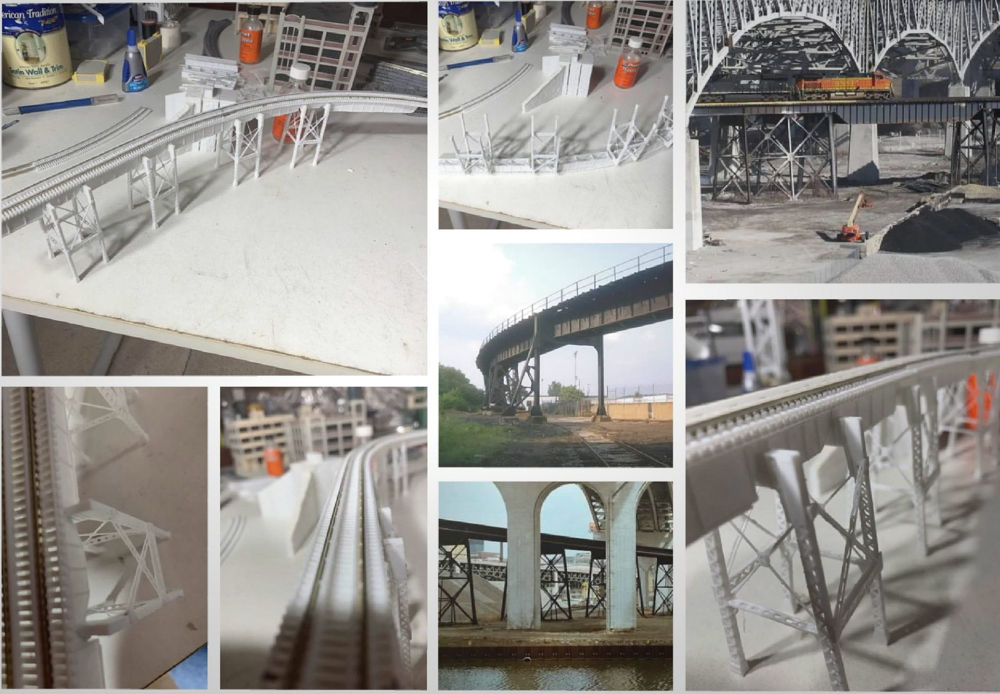
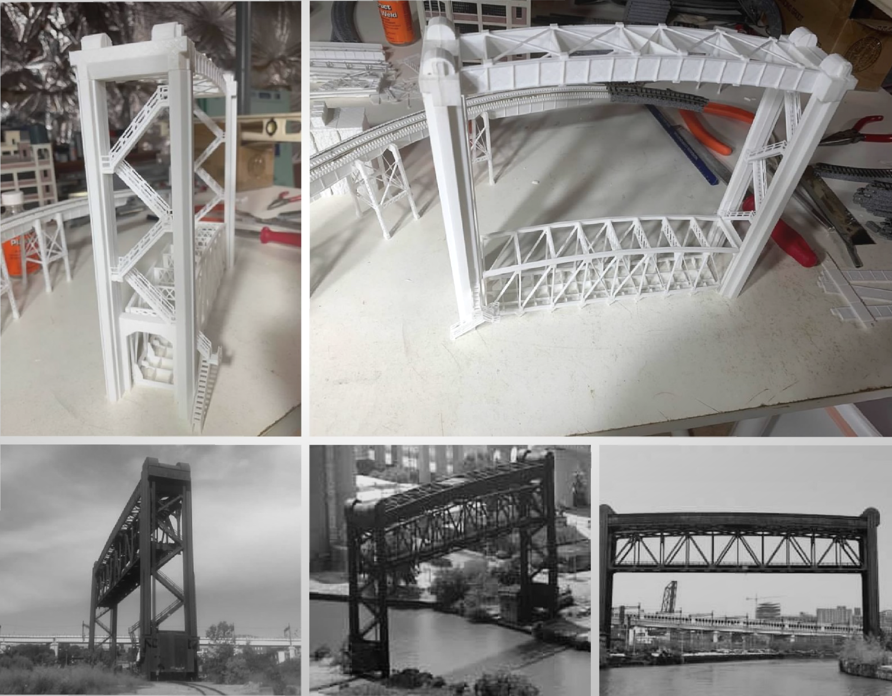
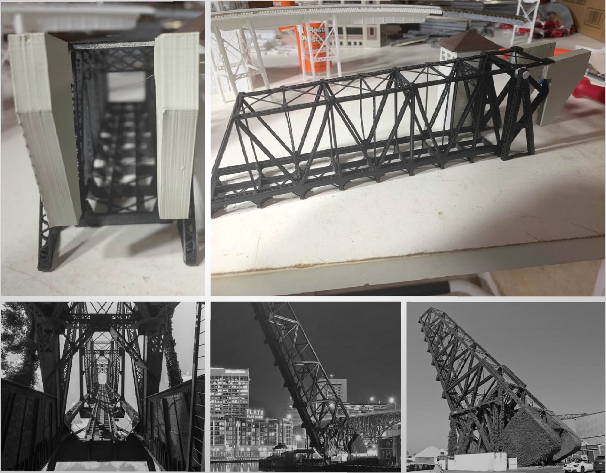
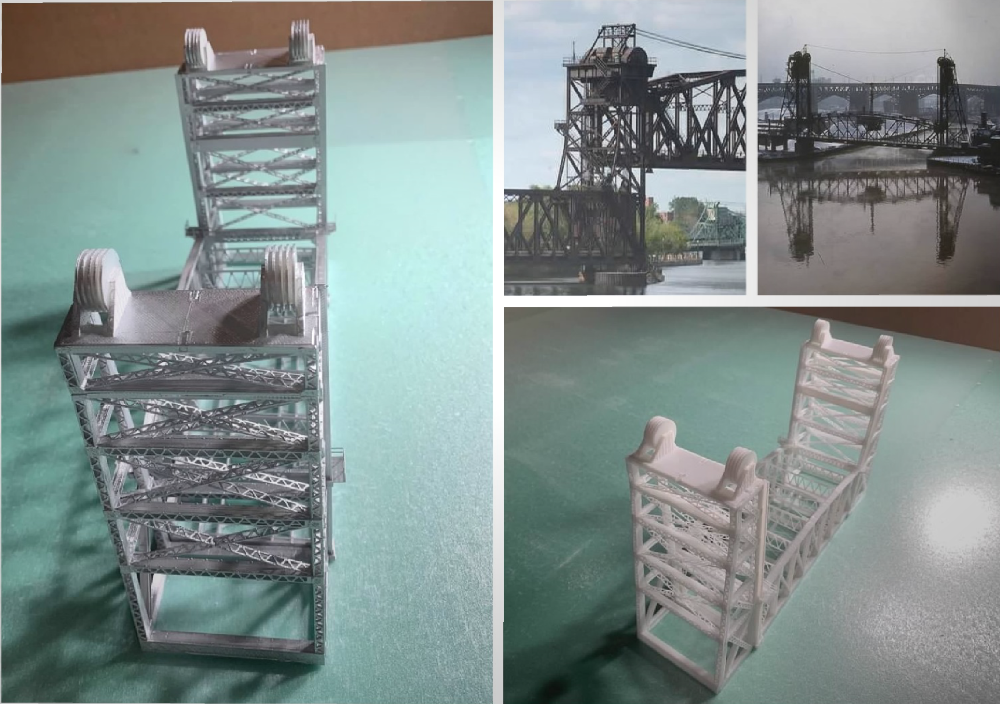

# My Original 3D Models Printed

I am combining my interests in 3D modeling, 3D printing, and model railroading. I am modeling the Cleveland Flats and its myriad of lift bridges over the Cuyahoga River. All of the bridge models are originals. Prototype inspirations are provided side by side for comparison.

[Back](https://github.com/nscale4by8/nscale4x8/blob/master/README.md)
