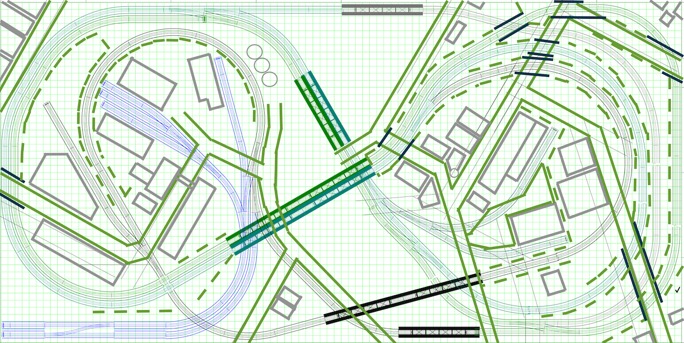

# nscale4x8
This repository contains information and resources related to my N Scale layout started 2019.

## Prototype Inspiration

I am loosely modeling the Clevelan Flats from around 1960. I seleted the prototype location for the opportunity to model densely packed industries and a complex web of rails. The prototype includes grades with over and under passes, level crossings, and multiple lift bridges.

- [B&O Right of Way Crossing Over Flats Industrial RR Right of Way](prototypeInspiration/BandO_overFlatsIndustrial.png)
- [Lift Bridges Over and Under](prototypeInspiration/LIftBridgesOverUnder.png)
- [Curved Approach to Lift Bridge](prototypeInspiration/curveToLiftBridge.png)
- [Crossing at Approach to Bridge](prototypeInspiration/levelCrossingAtBridge.png)
- [Turnout at Lift Bridge](prototypeInspiration/turnoutAtLiftBridge.png)
- [Multiple Spurs to Industries with MAny Grade Level Crossings](prototypeInspiration/industry.png)

## Track Plan

The plan is inspired by the famouse [Atlas Granite Gorge & Northern](https://www.modeltrainforum.com/picture.php?albumid=241&pictureid=2492). I adapted it to support more continuous run variations as well as opportunities for local switching on sidings while other trains run continuously. 

[Plan](../blob/master/benchwork/Rev8Blocks.pdf)

## 3D Printed Custom Bridges

[Models](../blob/master/Custom3DPrintedBridges.md)

## Benchwork, Test Fit, and Controls

[Benchwork](../blob/master/benchwork.md)

## Electronic Control

[Control](../blob/master/Control.md)
