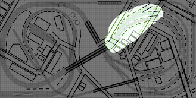

# Table of Contents

Section         | Teaser         
:-------------------------:|:---------------------------:
Prototype (Cleveland Flats) I am loosely modeling the Cleveland Flats from around 1960. I selected the prototype location for the opportunity to model densely packed industries and a complex web of rails. The prototype includes grades with over and under passes, level crossings, and multiple lift bridges.  |   
Track Plan  |  
Benchwork |  
3D Printed Bridges | 
Scenery Part 01 |  
3D Printed Retaining Walls and Underpasses |  
Roads and Sidewalks | 
3D Printed Custom Structures | 
Electronic Control | 
