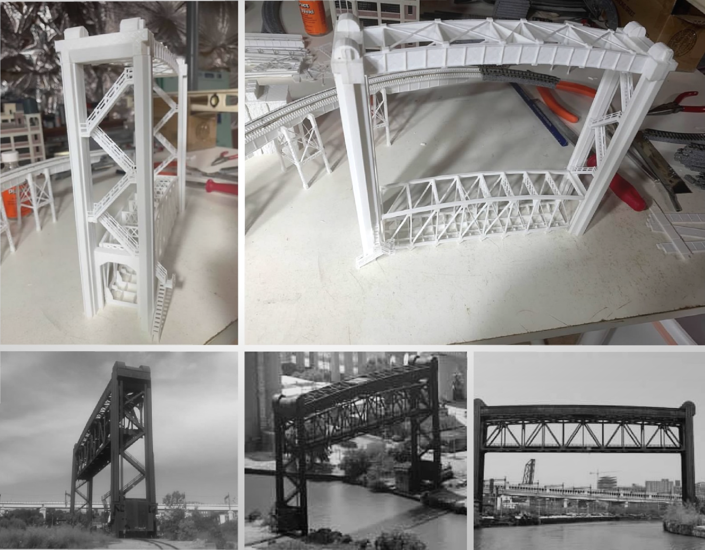

# nscale4x8
My first N Scale railroad and my first layout in 20+ years

I am combining my interests in 3D modeling, 3D printing, and model railroading. I am modeling the Cleveland Flats and its myriad of lift bridges over the Cuyahoga River. All of the models are originals. Prototype inspirations are provided side by side for comparison.

