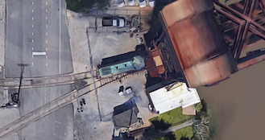

# Table of Contents

Section         | Teaser         
:-------------------------:|:---------------------------:
Prototype Inspiration (Cleveland Flats)  |   
Track Plan (Inspired by Atlas Granite Gorge & Northern)  |  
Benchwork Test Fit |  
3D Printed Custom Bridges | 
Scenery Part 01 |  
3D Printed Retaining Walls and Underpasses |  
Roads and Sidewalks | 
3D Printed Custom Structures | 
Electronic Control | 

- Prototype Inspiration (Cleveland Flats)

   
   
- Track Plan (Inspired by Atlas Granite Gorge & Northern)

   
   
- Benchwork Test Fit

   
   
- 3D Printed Custom Bridges

   
   
- Scenery

   - Part 01
   
      
      
      - 3D Printed Retaining Walls and Underpasses
      
         
         
      - Roads and Sidewalks
      
      - 3D Printed Custom Structures
      
         Model         |   Printed                   
         :-------------------------:|:---------------------------:
           |  
         
- [Electronic Control](controls/Control.md)
