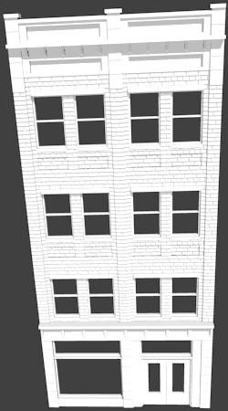
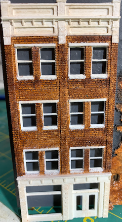
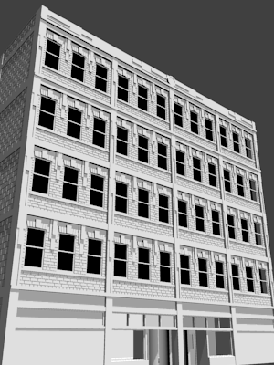

# N Scale 4x8
This is a site for information and resources related to my N Scale layout started 2019. The Table of Contents will guide you through brief descriptions of the techniques and approaches used so far.

## [Table of Contents](./index.md)

## Gallary

Here are some images found elsewhere on the site. If these pique your curiosity, checkout the Table of Contents.

### Halle's Department Store

### The Cleveland Twist Drill Co.

This amalgamation of multiple prototypes provides another indusrty to be serviced.

Model         |   Printed                   
:----------------------------------:|:----------------------------------:
  |  

[The Cleveland Twist Drill Co.](buildingClevelandTwistDrill/buildingCYDC.md)

### Hyde Building

The Hyde Building is a classic 1900s cast iron facade multi-purpose building reminiscent of the fringes of down town Cleveland at the edges of the Flats.

Model         |   Printed                   
:----------------------------------:|:----------------------------------:
  |  

[Hyde Building](buildingHyde/buildingHyde.md)

### Middle Building

The Middle Building is a modest structural brick bulding for the middle of the block.

Model         |   Printed                   
:----------------------------------:|:----------------------------------:
 |   

[Middle Building](buildingMiddle/buildingMiddle.md)

### Block Building

Odd spaces require special buildings. The Block Building fills a triangular lot backing on the railroad embankment.

Model         |   Printed                   
:----------------------------------:|:----------------------------------:
 |   

[Block Building](buildingBlock/buildingBlock.md)

# Gallary

