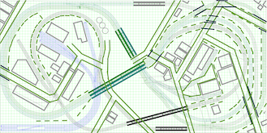
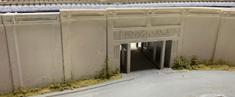
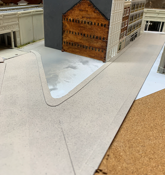
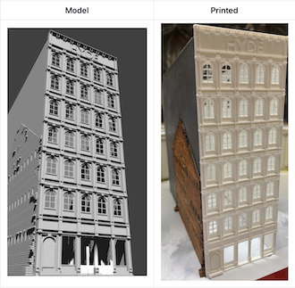

# Table of Contents

Section         |  Teaser         
:-------------------------:|:---------------------------:
**Prototype (Cleveland Flats)** Densely packed industries ,complex web of rails, grades with over and under passes, level crossings, and multiple lift bridges.  |  
**Track Plan** [Atlas Granite Gorge & Northern](https://www.modeltrainforum.com/picture.php?albumid=241&pictureid=2492) |  adapted it to enable more continuous run variations
**Benchwork** dimensional lumber covered with 2 inch medium density foam | 
**3D Printed Bridges** Antique to old to modern lift bridges | 
**Scenery Part 01** |  
  | 3D Printed Retaining Walls and Underpasses
 | Roads and Sidewalks - Styrene is actually a "For Sale" sign purchased from Wall-mart
 | 3D Printed Custom Structures - Start to fill in the urban-industrial scenes
**Electronic Control** Raspberry Pi B+ with an add-on "hat" | 
