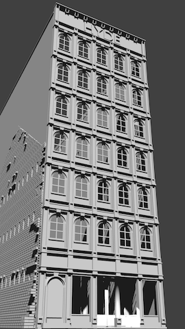

# Table of Contents

- Prototype Inspiration (Cleveland Flats)
   
- Track Plan (Inspired by Atlas Granite Gorge & Northern)
   
- Benchwork Test Fit
   
- 3D Printed Custom Bridges
   
- Scenery
   - Part 01
      
      - 3D Printed Retaining Walls and Underpasses
         
      - Roads and Sidewalks
      - 3D Printed Custom Structures
         Model         |   Printed                   
         :-------------------------:|:---------------------------:
           |  
- [Electronic Control]
