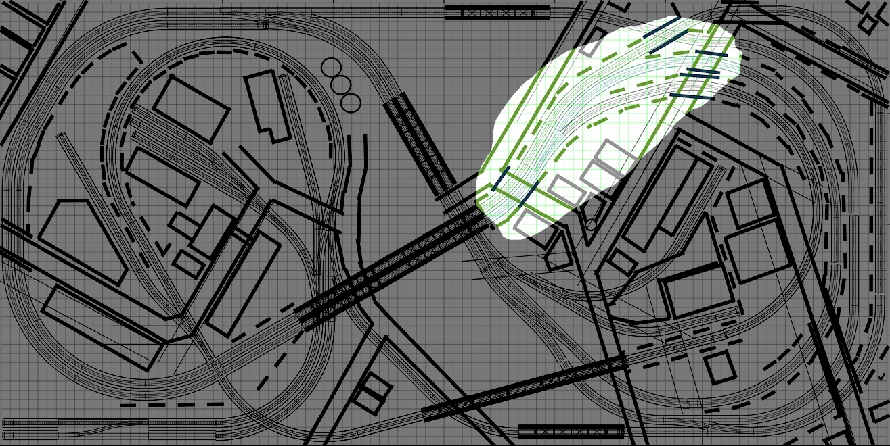
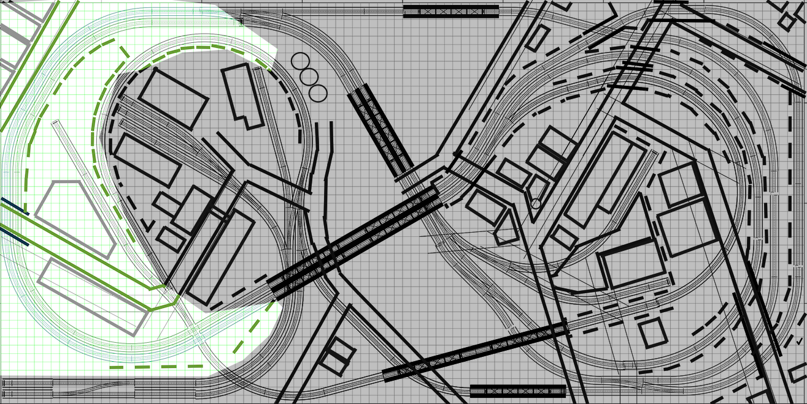
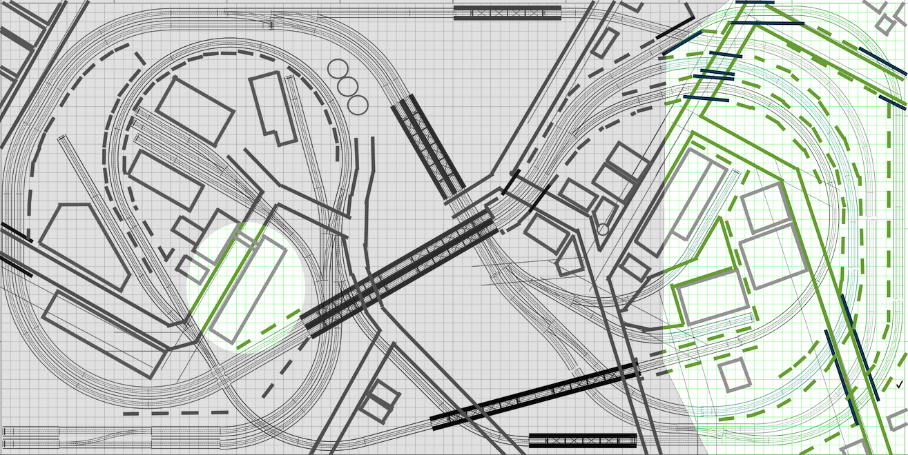

# Scenery

For me, Model Railroading is largely an excuse for building scenery. I enjoy operating trains, but 3D modeling and scenery are my favorite aspects of the hobby. To a certain extent, everything I've done so far from sawing and glueing wood to researching the prototype to wiring has been preparation for scenery construction. I paint portraits, I write textbooks, I design and implement software, and lately, I model railroads. These are all outlets for creative expression.

## Part 01
I started with the concrete retaining walls for the viaduct leading up to the large double track bridge in this general area.

[Scenery for this section](part01/part01.md)

## Part 02
This area has a "cut" for the double track main line through sedimentary rock. Most of the layout is city-scaped featuring cats concrete, briks, steel, and asphalt. This section lets a little bit of nature peek through.

[Scenery for this section](part02/part02.md)

## Part 03
This area contains more rock formations, tunnels under urban infrstructure, and numerous industries.

[Scenery for this section](part03/part03.md)

[Edge of Urban Core](part03/part03.md)

[Lift Out Sections](liftOutSections/liftOut.md)

[Overhead View](IMG_1215.png)
[Overhead View](IMG_1260.png)

[Back](https://nscale4by8.github.io/nscale4x8/)
