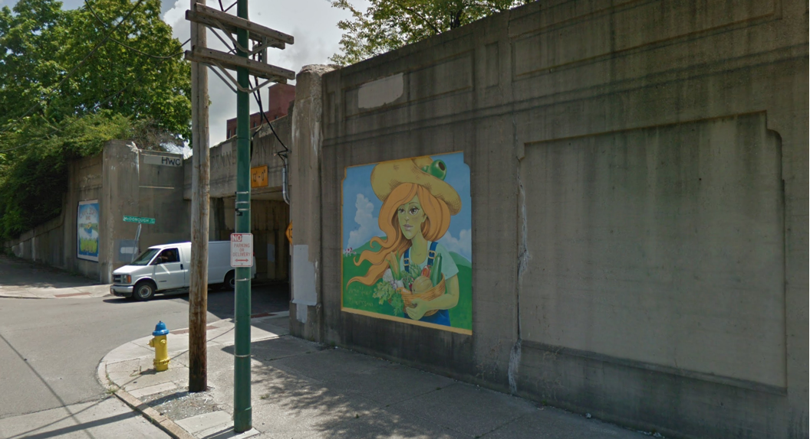
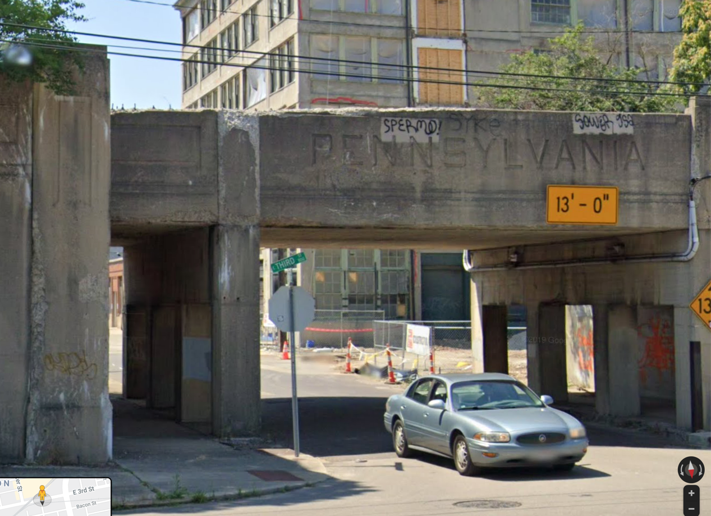
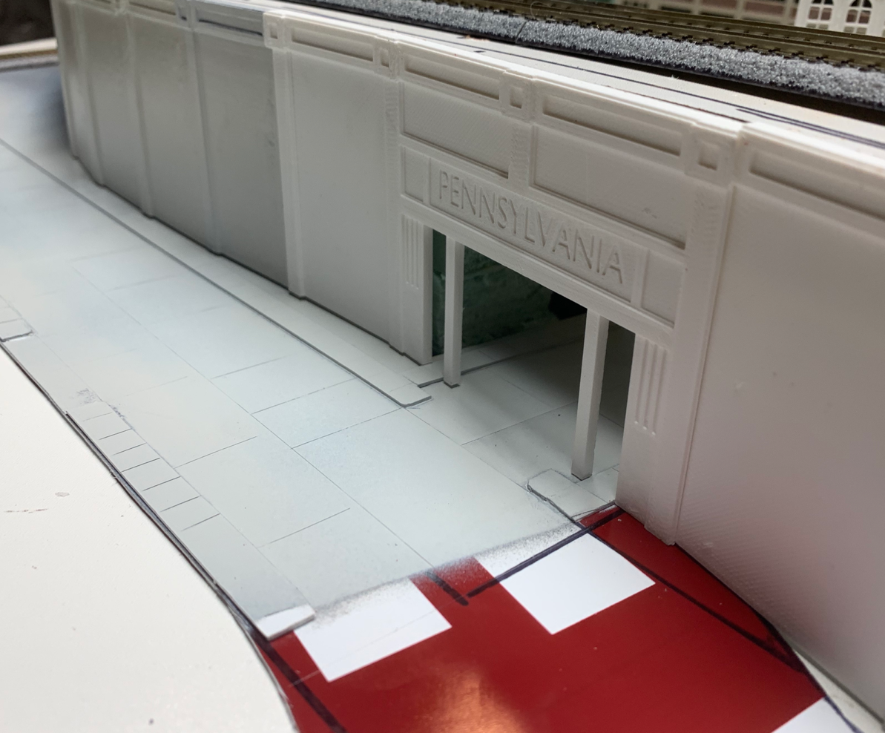
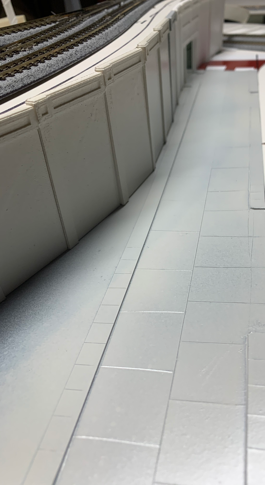
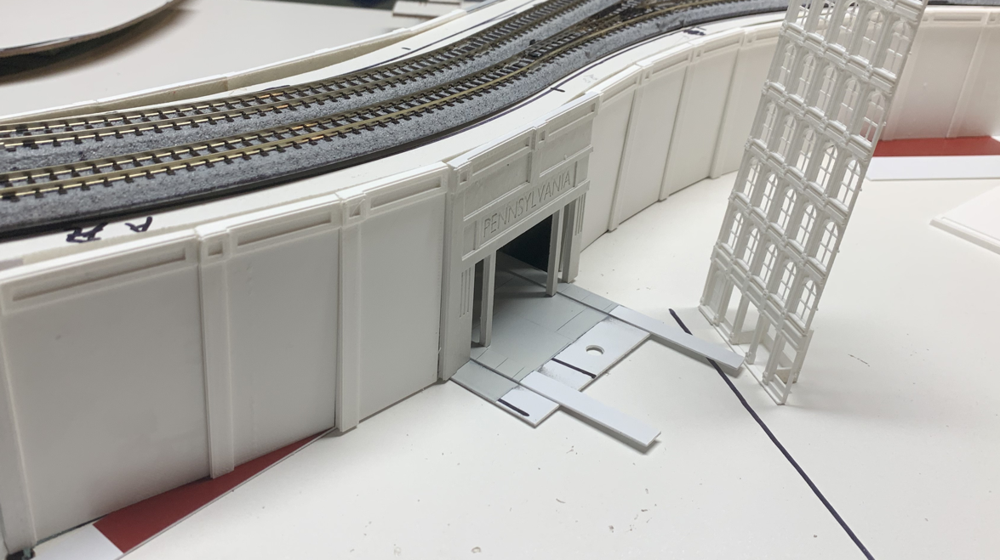
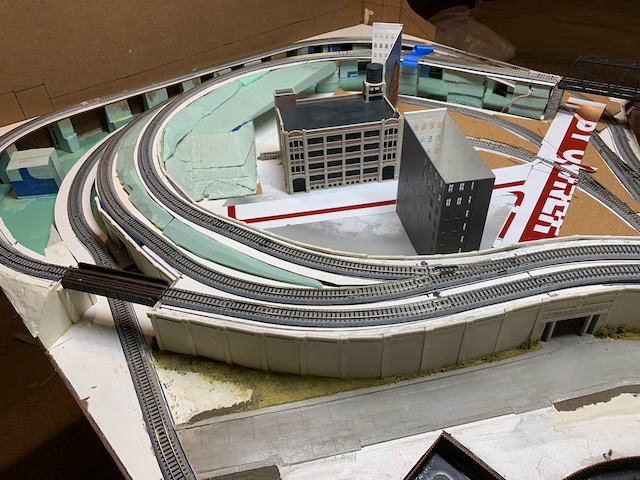

# Part 01

I used this prototype inspiration for the viaduct:
 

Here is the first pass dry-fitting the 3D printed parts and the sheet styrene parts:
  

## Sheet Styrene
The sheet styrene pictured for the road and sidewalk is actually a "For Sale" sign I purchased from Wall-mart for $4.00. You have probably noticed that buying sheet styrene at hobby stores is expensive. It's not unusual to pay $10 for a package containing one or two 4x10 inch [10x25cm] sheets. Inexpensive signs are made from the exact same styrene material at 1/10th the price. You can find signs in sizes from 4x4 inches [10x10cm] to 30x20 inches [76x50cm]. You can find signs in a variety of thicknesses from 1/32 inch [0.8mm] to 1/8 inch [32mm]. There are only a couple of down sides to cutting up signs: A) The signs tend to be painted as opposed to bare white. B) Some signs have holes cut into them for attachment fixtures. I paint the styrene after it has been glued, so any pre-existing paint is covered. I either cut around the holes, or when modeling N-Scale roads, I use the holes as manholes. They are just the right size.

The pictures of the road show a hole and portions of the sign that haven't been painted yet.

Once I'm completely satisfied with the dry fit, I'll glue the retaining walls and road to the benchwork. Then, I'll weather the walls and road, add details like tire-tread marks, cracks in the concrete, etc. Eventually, I'll add grass and trees to produce a scene similar to the prototype inspiration.

[Back](../Scenery.md)
