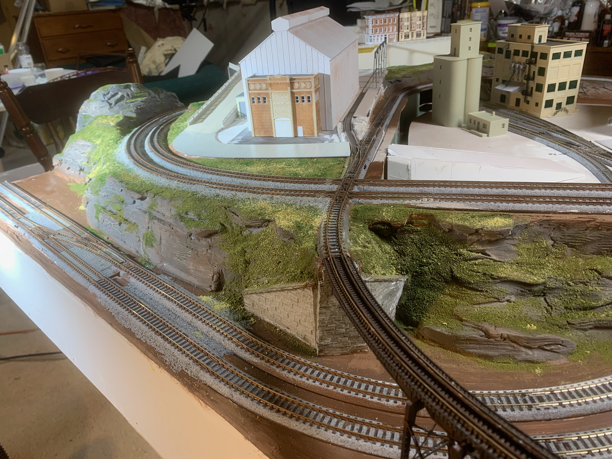
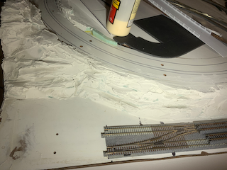
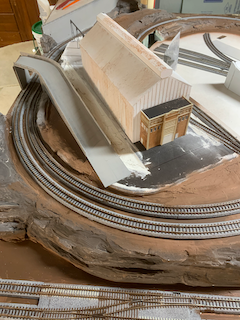
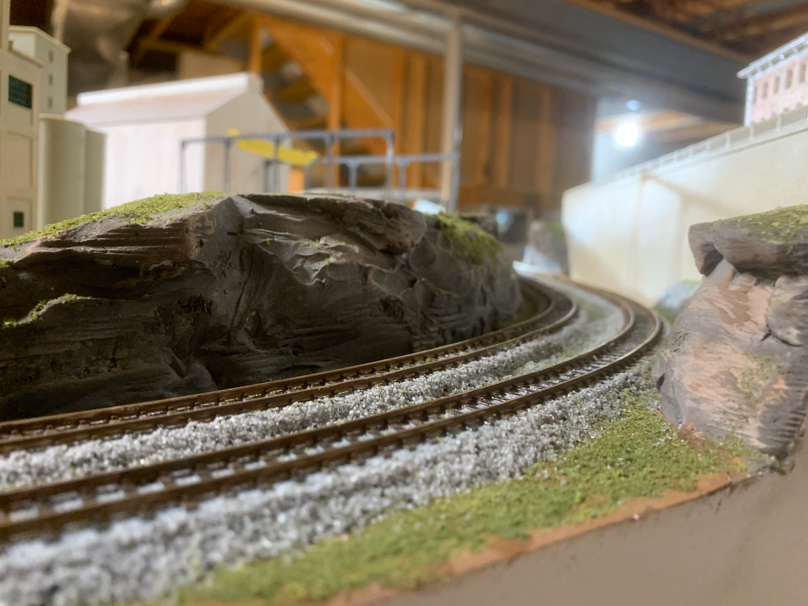

# Part 02

I used these prototype inspirations:

Prototype         |        Prototype              
:----------------------------------:|:----------------------------------:
  |   
 |  

## Scenery in progress...

### Roughly sculpted foam

### 3d printed railings on overpass, plaster, painted but not weathered

Before         |   Aftre                   
:----------------------------------:|:----------------------------------:
  |  
  |  
  |  
  |  
  |  

[Back](../Scenery.md)
