# Part 02

I used these prototype inspirations:

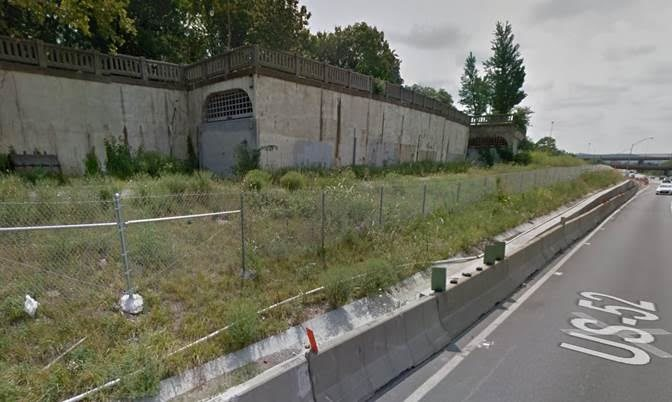 
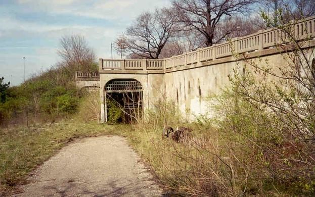 
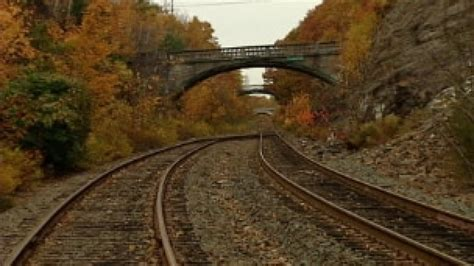
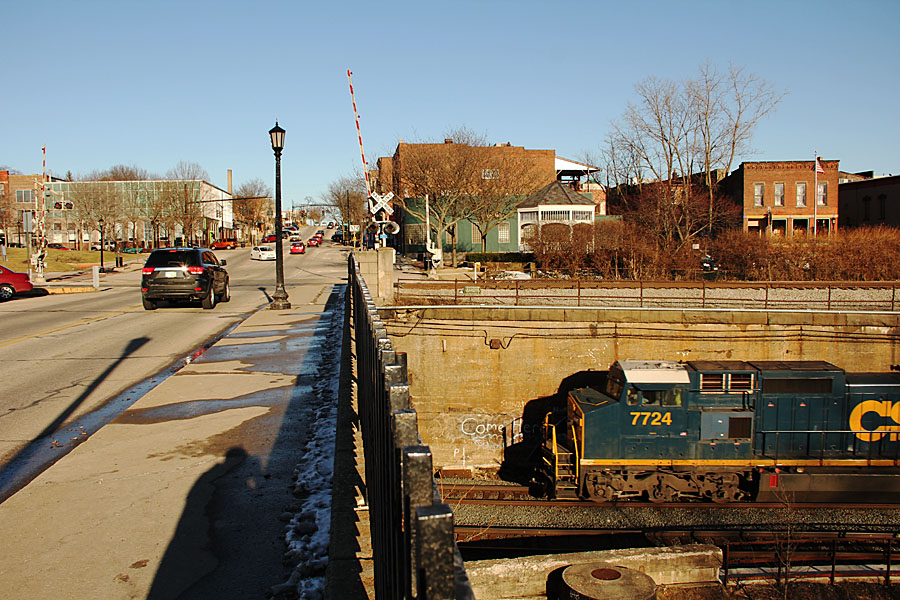

## Scenery in progress...

### Roughly sculpted foam

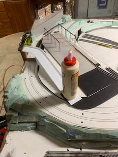
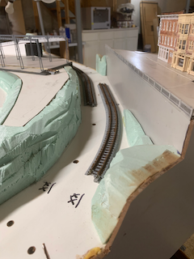
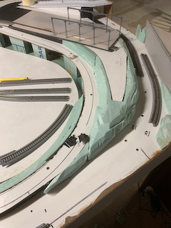
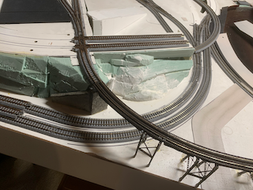

### 3d printed railings on overpass, plaster, painted but not weathered

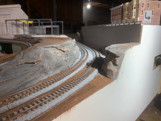
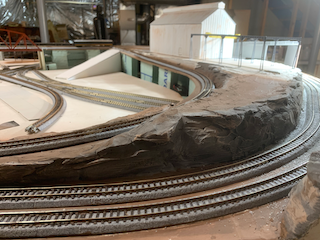
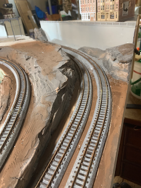
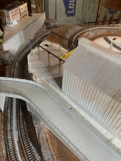
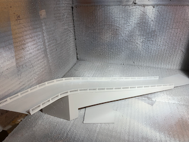

[Back](../Scenery.md)
