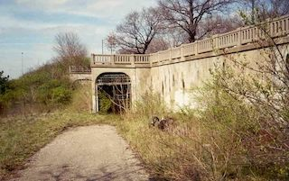
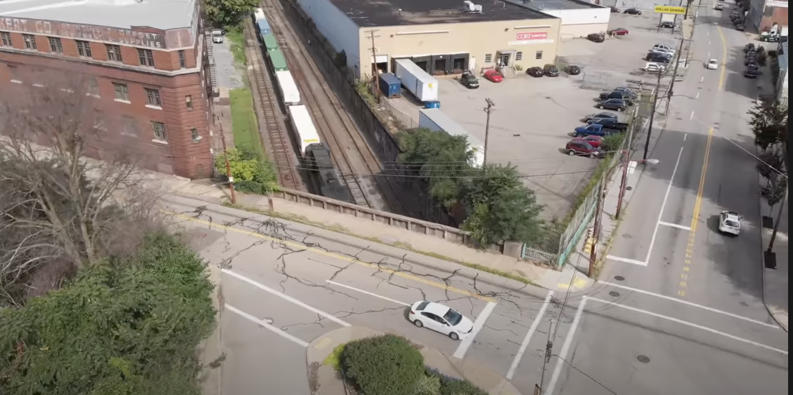
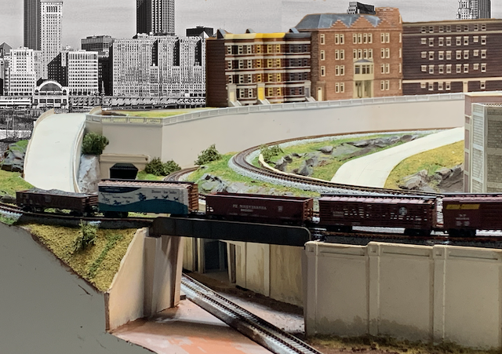
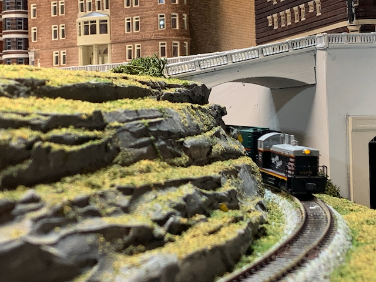
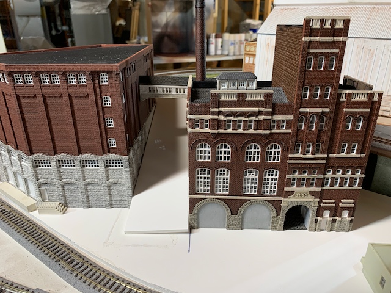

# Part 03

I used these prototype inspirations:

Prototype         |        Prototype              
:----------------------------------:|:----------------------------------:
  |   
  |  
 | 
 | 

## Scenery in progress...

Model         |        Model              
:----------------------------------:|:----------------------------------:
 | 
 | 
 | 

[Back](../Scenery.md)
