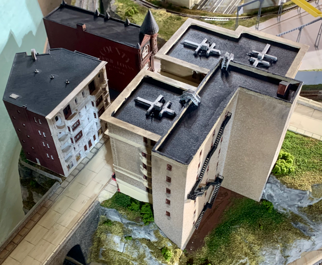
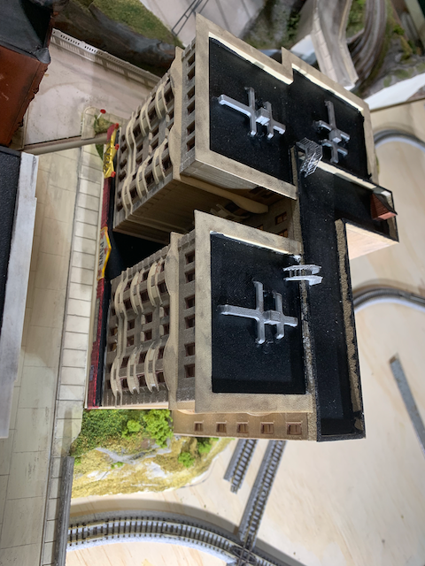
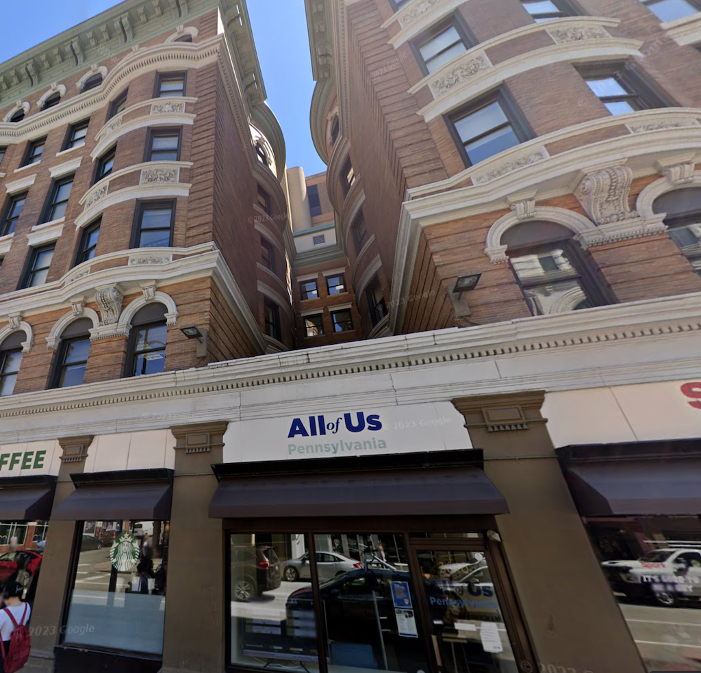
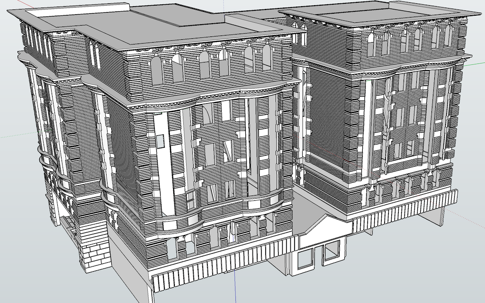
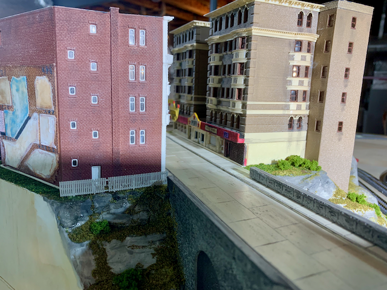
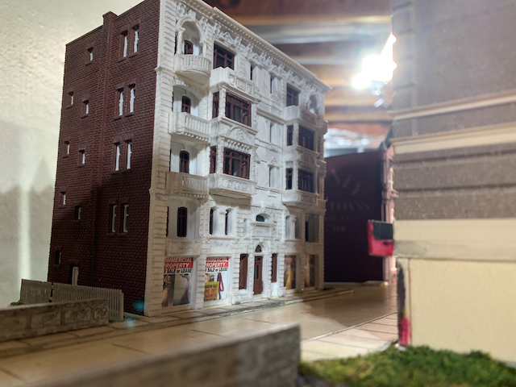
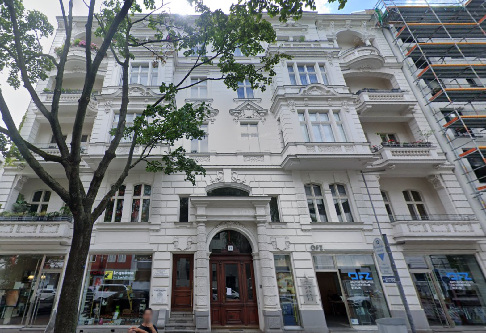
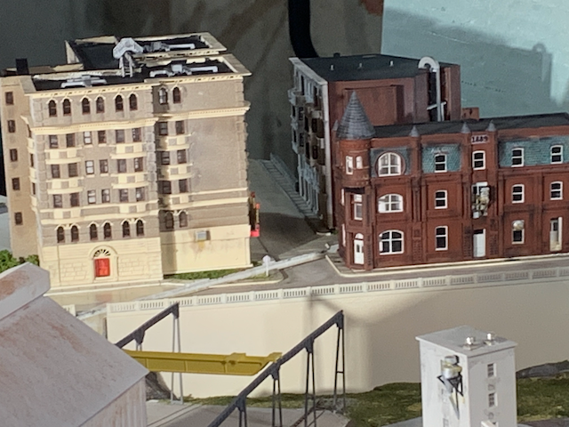
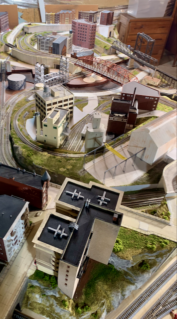

# 2024 Annex

As of mid-2024, a dearth of space space for more 3D printed structures on the main 4'x8' NScale "Cleveland Flats Industrial Railroad" prompted construction of a annex. A second full 4'x8' bringing the total size to 4'x16'seemed over ambitious. Coincidentally, pent up desire to exhibit the layout(s) swelled. The 4'x8' was built to be light weight and could be taken to shows, but it would be quite a production. The best of all worlds in this case is a 4'x30" N-Track Module that attaches to the existing 4'x8' but can also be taken to shows and incorporated in modular layouts.
 
The layout represets the urban industrial squalor of the Cleveland Flats in the 1970s. A kindred spirit, David K. Smith, modeled the Jersey City Industrial Railroad and wrote, "Perhaps the documentation on this layout will inspire someone else to take it all the way to the finish line." Inspiration greatly influenced adaptation of David K. Smith's Jersey City Industrial Railroad plan for a slightly larger 4'x30" form factor and for integration with my existing layout.

