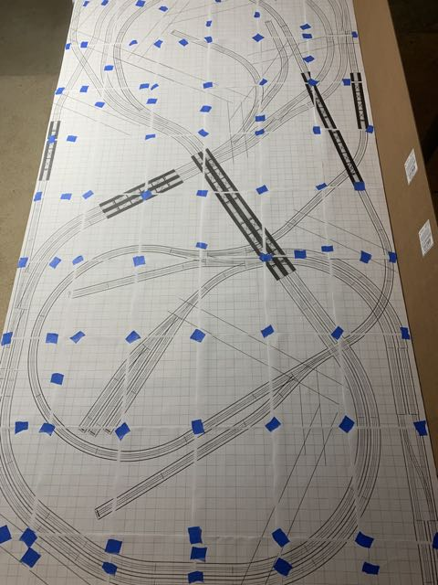
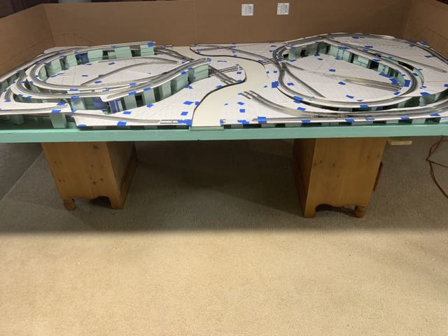

# Benchwork and Test Fit
The benchwork is currently dry-fit. Nothing is glued down. All of the wiring is in place for four separate electrical blocks. All turnouts are remotely operated by the Control System. I plan to test the layout for a while to assure reliable operation because once the benchwork is glued, it will be very difficult to modify wiring.

The benchwork consists of 1x2 dimensional lumber covered with 2 inch medium density foam. Then another quarter inch of foam covers everywhere except the river. Channels are cut in the quarter inch foam to provide routing for bundles of wires. On top of the quarter inch layer, one inch foam "feet" support the lowest track elevations. Feet of various lengths create grades and elevated sections. Pre-primed Masonite rests atop the foam feet. Track will eventually be glued to the Masonite.

The track plan is drawn in XtraCAD and then printed full size. The pages are aligned and taped to each other but not to the underlying masonite.

The masonite is cut with a saber-saw, and medium density styrofoam is used to produce elevated sections and grades.

I designed lift bridges in SketchUp and Blender. In most cases, I had to make several test prints and minor changes to 3D models before everything worked right. The unpainted modern lift bridge on the right side of the photo is so-far the only time one of my models has printed just right on the first try. The bridges are designed to fit the track plan with tight tolerances. It was necessary to test fit everything full-sized on the cut masonite. There weren't any significant problems with the elevations or fit. I attribute the success to using full size CAD drawings and the fact that 3D printers produce dimensionally accurate results. In my limited experience, if I had scratch built the bridges from styrene or wood, there would have been endless tweaking and adjusting to get the right fit.

The bidge ties are 3D printed in the largest curved sections my printer can produce.  Tie guide rails, plates and spikes are part of the printed model with tolerances so tight that the rails require light force slide into place. Once the rails are in, a couple of spots of super glue on the outsides of the rails fix them permanantly in place. 3D printing is able to produce the correct gauge every time. The result is solid. 

The red bridge is a standard Tomix product that is 22 inches long. I may eventually replace it with a 3D printed concrete arch bridge, but It works well for now.

[Back](https://nscale4by8.github.io/nscale4x8/)
