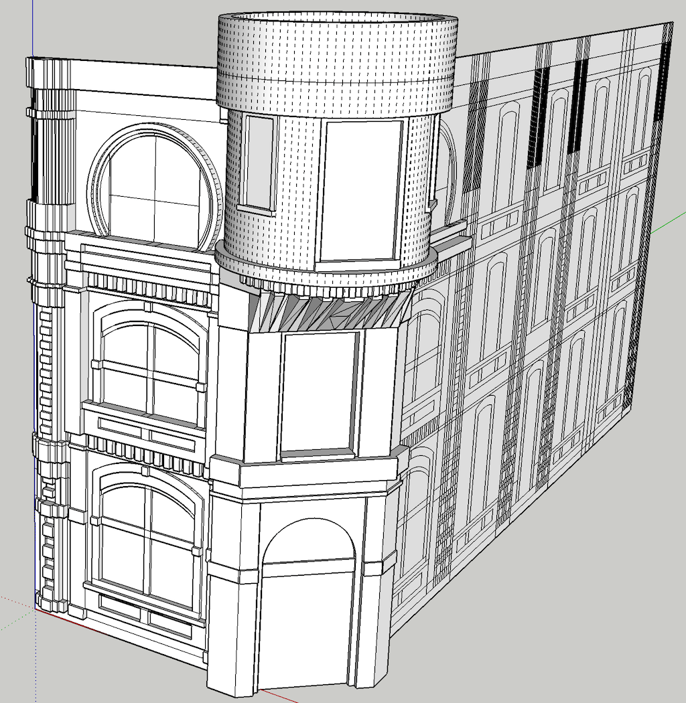
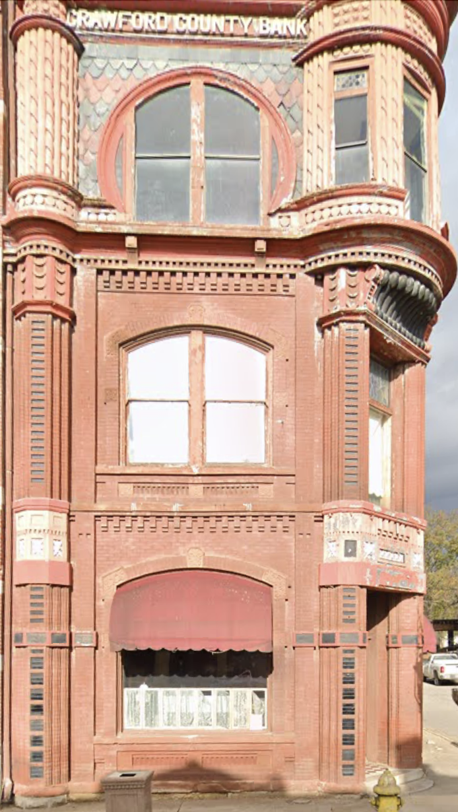
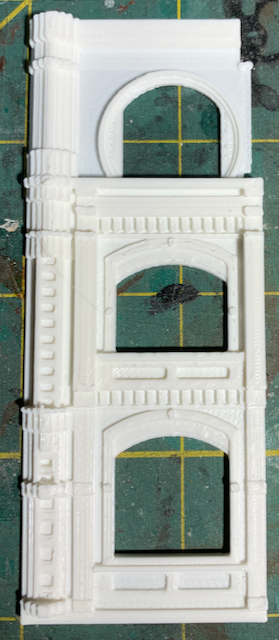

# Bank in Van Buren, AR

A post at [Model Railroad Hobbiest MRH Forum](https://forum.mrhmag.com/post/interesting-prototype-structure-library-12629898?trail=275) contains many images of prototype structures. [One in particular](https://tile.loc.gov/storage-services/service/pnp/mrg/04000/04046v.jpg) sparked my interest. I don't have any place to put the structure on my current layout, but it's still cool to model and print it.

Front Elevation         |   Second Test Print                   
:----------------------:|:----------------------------------:
 | 

Front Elevation         |   First Test Print                   
:----------------------:|:----------------------------------:
 | 

[Short video of first test print](testPrintVideo720p.mp4)
