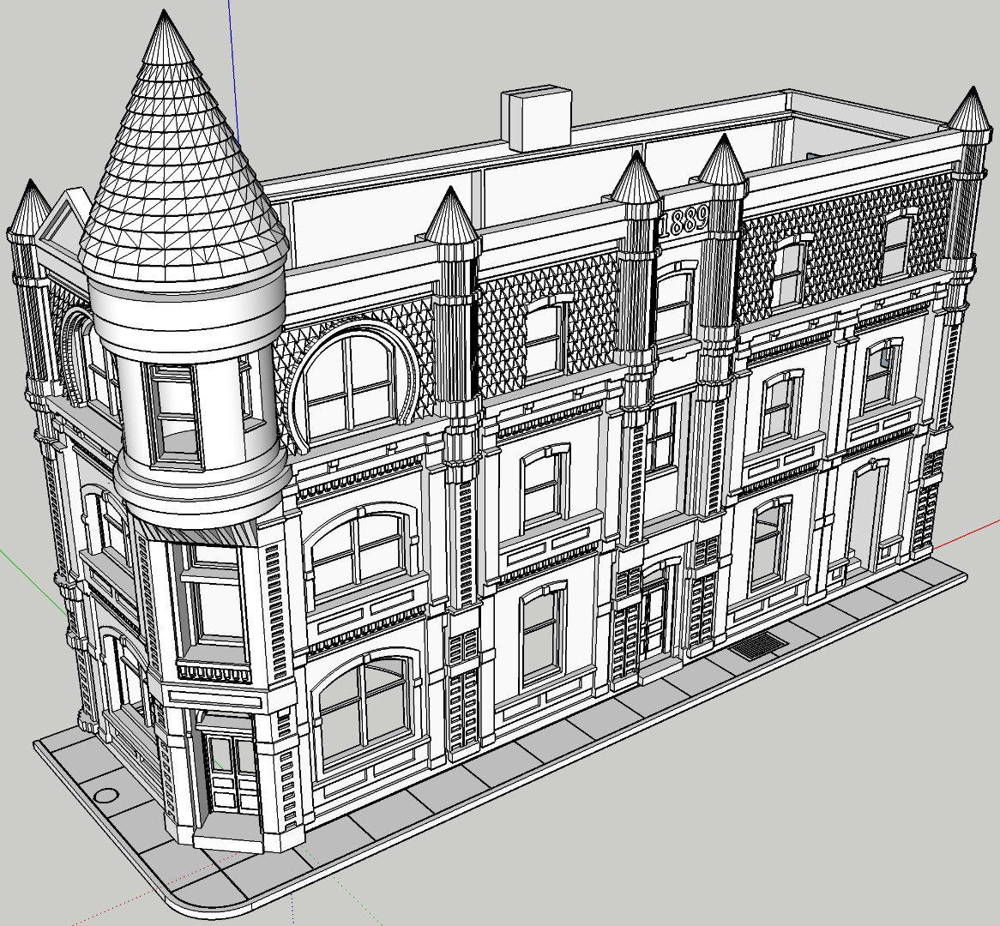

# Bank in Van Buren, AR

A post at [Model Railroad Hobbiest MRH Forum](https://forum.mrhmag.com/post/interesting-prototype-structure-library-12629898?trail=275) contains many images of prototype structures. [One in particular](https://tile.loc.gov/storage-services/service/pnp/mrg/04000/04046v.jpg) sparked my interest. I don't have any place to put the structure on my current layout, but it's still cool to model and print it.

Front Elevation         |   Third Test Print                   
:----------------------:|:----------------------------------:
| 
| 

I make test prints to refine the 3D models and dial in the printer settings to get the level of detail I want. The third test print shown is fresh off the printer with no post processing at all. Typically, a little bit of sanding and some clear nail polish improve the flat surfaces. Sanding removes tiny ridges of plastic, and the nail polish solvent slightly dissolves the plastic to both smooth surfaces and fill any tiny unwanted grooves. After the nail polish dries, the surface can be painted as normal.

The third test print has correctly sized brick details, shingles on the third floor facade, plus edges and notches that will serve as interlocking components when the structure is assembled. Edges and notches assure alignment of the separate parts during assembly. Models often have tolerances that allow the parts to fasten together without glue. However, when glue is used, it's important to have enough surface area for the glue joint.

Front Elevation         |   Third Test Print                   
:----------------------:|:----------------------------------:
| 
| 
| 

[Short video of first test print](testPrintVideo720p.mp4)
