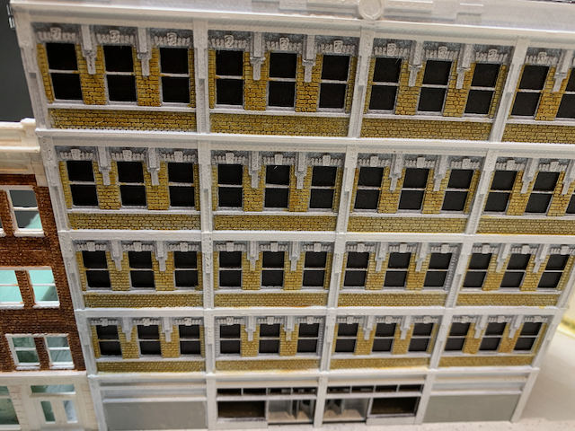

# The Block Building

One of the great things about designing my own buildings is the ability to use odd shapes. I have a triangular space sandwiched between road frontage and an elevated railroad embankment. I've modeled a small alley and loading dock for deliveries and other services. The building has a twin revolving entry doors. I haven't seen that modeled before and think the detail adds novelty.

The Block building is a five story reinforced concrete structure prototypical of the 1930s through today. It has brick curtain walls and elaborate window casings on the front facade but uses lower cost concrete blocks elsewhere.

The building may have been a department store, an office building, a hotel, or even a warehouse. I have chosen to make it a vacant building available for lease. I'll add signage and maybe board up some of the windows.

