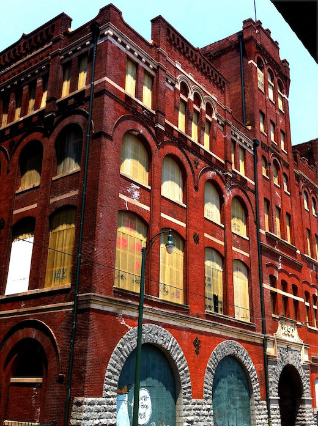
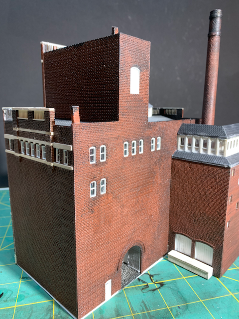

# Tennessee Brewery in Memphis TN 

While modeling the Cleveland Flats, I searched the Internet for interesting old buildings when I stumbled upon the Tennessee Brewery in Memphis TN.

Prototype        |   Model                   
:----------------------------------:|:----------------------------------:
  |  
  |  

I modeled the Tennessee Brewery in N Sclae with a bit selective compression. In these photos, the paint isn't even dry yet. When teh paint dries, I'll brush away the lint stuck to the model and weather things a bit more. 

The model includes some interior details visible through the large windows but not captured well in photos. 

