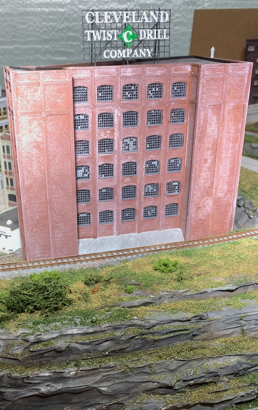
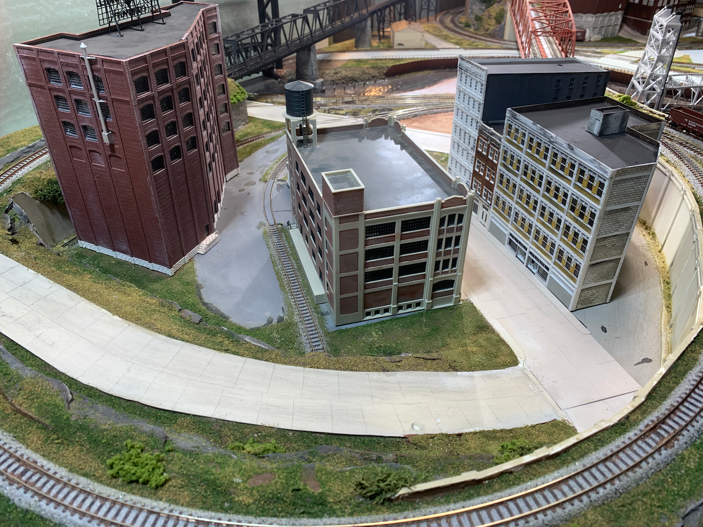
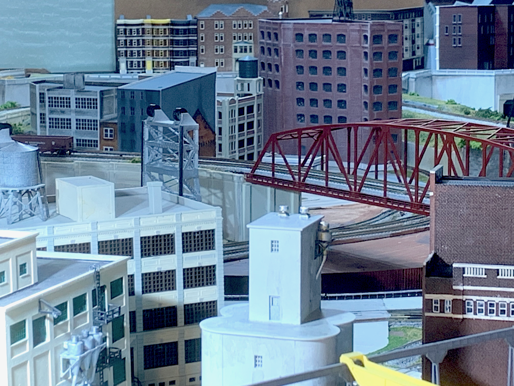

# Cleveland Twist Drill Company

As I fill in my model of the Cleveland Flats industrial area circa 1970, I look for prototypical references to intersting industries for my model railroad to service. I started designing this structure to be "Lincoln Electric", a business well know in Cleveland, but while researching the prototype, I ran across a [logo for "The Cleveland Twist Drill Company"](https://946e583539399c301dc7-100ffa5b52865b8ec92e09e9de9f4d02.ssl.cf2.rackcdn.com/7221/243089.jpg). Then, I stumbled upon a [photo of the Starrett company's sign](https://upload.wikimedia.org/wikipedia/commons/thumb/8/80/Starrett_Tools%2C_Athol_MA.jpg/1920px-Starrett_Tools%2C_Athol_MA.jpg).

This large model was printed in many parts over several days with half a dozen failed prints along the way. The larger the print, the more likely there will be unacceptable printing defects. Unlike the previous buildings I've modeled, I printed and painted the windows separate from the walls. There are a LOT of windows, and almost every one needed touchup with an hobby knife to clean away "strings" and "blobs" that occur in the first few layers of each print. The windows only have a few layers.

The walls are almost 3mm thick, but the insides of the walls are filler that is mostly air. Making the walls thick provides a large surface area for gluing. The walls also tend to be square without gaps at glue joints because of the extra thickness. The building is 8 floors tall, but my printer's build plate only has room to print seven floors at a time. The eighth floor walls are printed separately and use a brick detail to hide any seams at the glue joint with the lower wall.

The large sign, 60 scale feet wide, was a fun detail added at the end.

# Other Details 
                  

While designing this structure, I refined a system for securely and accurately joining walls using tabs and slots. The printed parts have dimensions reliably accurate to 0.02mm. The printed parts fit  with interlocking elements that are snug. The buildings hold together without glue for a while, and even the windows stay in place without glue during assembly. I expect to use this design system for future building models.
}

[Back](https://nscale4by8.github.io/nscale4x8/)
