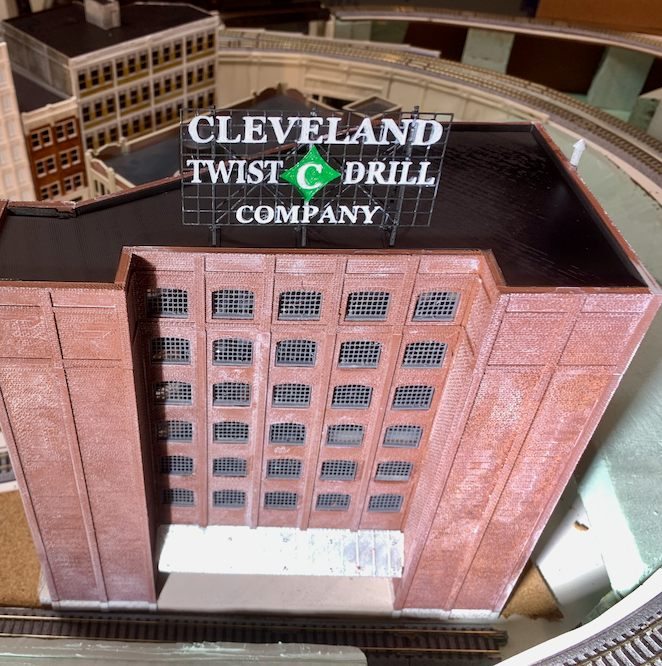
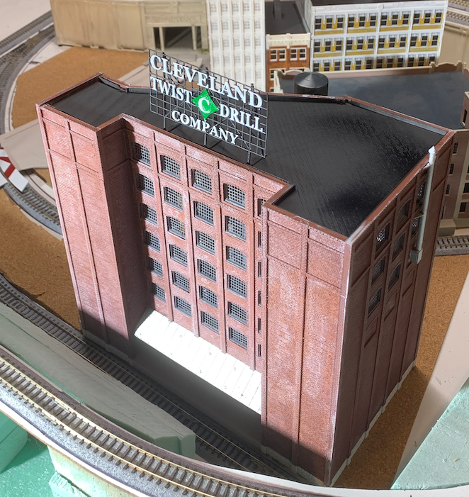
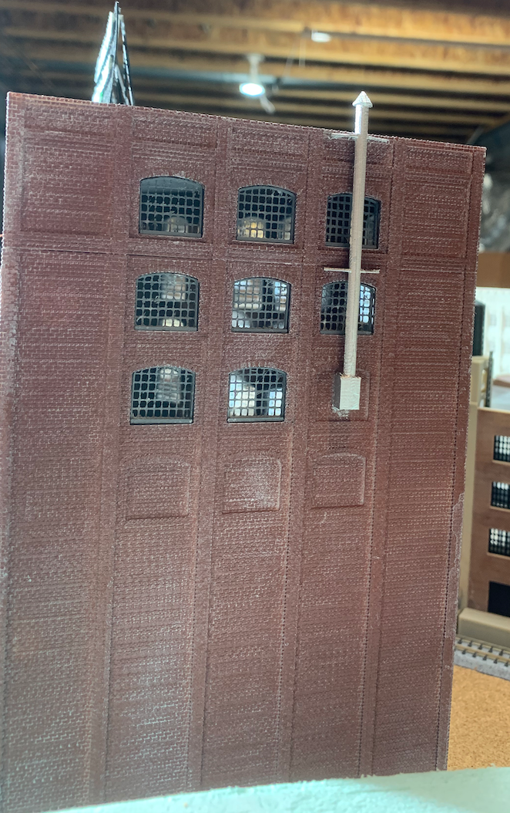
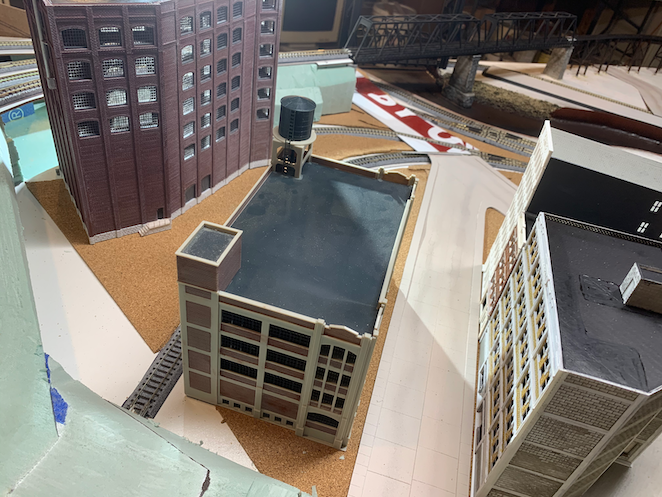
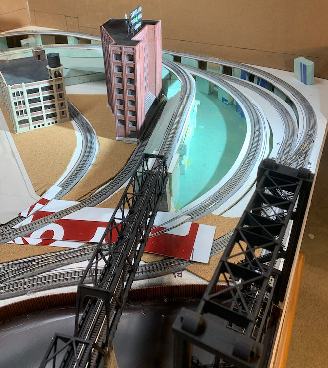

# Cleveland Twist Drill Company

As I fill in my model of the Cleveland Flats industrial area circa 1970, I look for intersting industries to service as well as  prototypical references. I started designing this structure to be "Lincoln Electric", a business well know in Clevelan, but while researching the prototype, I ran across a [logo for "The Cleveland Twist Drill Company"](https://946e583539399c301dc7-100ffa5b52865b8ec92e09e9de9f4d02.ssl.cf2.rackcdn.com/7221/243089.jpg). Then, I happend upon a [photo of the Starrett company's sign](https://upload.wikimedia.org/wikipedia/commons/thumb/8/80/Starrett_Tools%2C_Athol_MA.jpg/1920px-Starrett_Tools%2C_Athol_MA.jpg).

# Other Details 

Back         |   Other Side                   
:----------------------------------:|:----------------------------------:
  |  
  |  
  |  
  |  

[Back](https://nscale4by8.github.io/nscale4x8/)
