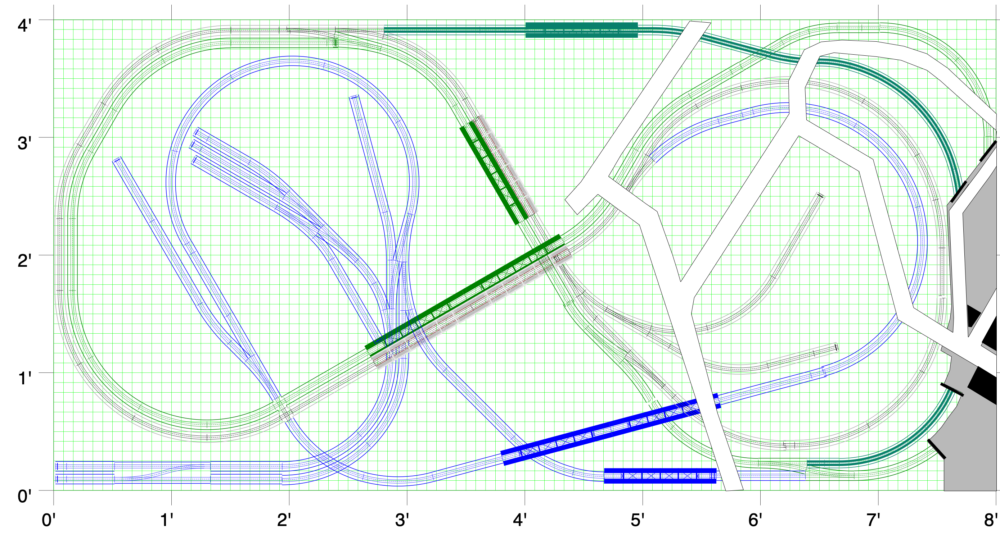

# Corner Building

For the most part, I was able to envision the scenery and structures I wanted for this layout before I cut the first piece of foam. The big exception was the edge of the plan where there are four nearly parallel tracks at four different elevations. The famous "Granite Gorge & Northern" hides the four track area inside a mountain. I'm modeling an urban environment loosely based on the Cleveland Flats Industrial District. There are no mountains in Cleveland.

The solution came to me while I was browsing Google Street View for prototype inspiration. I came across an urban covered cut. The following images show the West and East entrances to the never completed Cincinnati subway. The subway was constructed by digging trenches (a cut), pouring concrete walls and roof to form tunnels, and then covering by re-grading over the the tunnels. In many places, roads were routed above the covered cuts.

West entrance         |   East entrance                  
:----------------------------------:|:----------------------------------:
 |  

This Cincinnati prototype is perfect for my layout. The view from above the cut is similar to the view I want my layout to model.

I revised my scenery plan to incorporate two covered cuts, but the new plan has its own challenges.

With two of the four parallel tracks hidden from view, I need roads, railings, and structures to fill the area above the tracks. I decided to design structure models and 3D print them. It's an opportunity for a few more "focal point" scenes along with the 3D printed lift bridges and the large commercial buildings already designed and printed.

For the first of the new structures, I chose the following prototype to inspire my design for the "Corner Building":

## The Corner Building

I consider the first print a draft. As I write this, a second 8 hour long print is in progress.

Draft print - prototype color scheme  |   Draft print if greige color scheme                   
:----------------------------------:|:----------------------------------:
  |  

## Details about the printing

The bay windows in this model require a 2.34cm [almost an inch] bridge [printing over air]. I have never tried to print with such large bridges before, so I am somewhat amazed it works as well as it does. I don't even get much "stringing" which is the usual result of printing over air - it's like a spider spraying silk into the wind.

In the past, I have printed walls flat and then assembled the structures from parts. This is the first significant structure I have printed as all one piece. On the rare occasions I've needed bridging in the past, I included cut-away supports for long spans over air. In a smaller test print to verify the printability of certain model aspects, some of my cut-away supports didn't print. I accidentally made them thinner that the print head nozzle. To my surprise, the bridging parts worked anyway, so I just deleted the supports.

[Back](https://nscale4by8.github.io/nscale4x8/)
