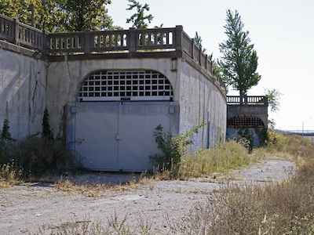
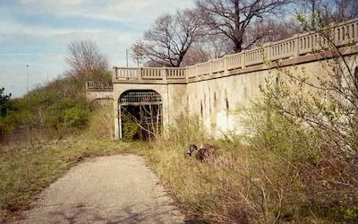

# Corner Building

For the most part, I was able to envision the scenery and structures I wanted for this layout before I cut the first piece of foam. The big exception was the edge of the plan where there are four nearly parallel tracks at four different elevations. The famous "Granite Gorge & Northern" hides the four track area inside a mountian. I'm modeling an urban environment loosely based on the Cleveland Flats Industrial District. There are no montains in Cleveland.

The solution came to me while I was browsing Google Street View for prototype inspiration. I came across an urban covered cut. The following images show the West and East entrances to the never completed Cincinnati subway. The subway was construted by digging trenches (a cut), pooring concrete walls and roof to form tunnels, and then covering by re-grading over the the tunnels. In many places, roads were routed above the coverred cuts.

West entrance         |   East entrance                  
:----------------------------------:|:----------------------------------:
 |  

This Cincinnati prototype is perfect for my layout. The view from above the cut is similar to the view I want my layout to model.

I revised my scenery plan to incorporate two coverred cuts, but the new plan has its own challenges.

With two of the four parallel tracks hidden from view, I need roads, railings, and structures to fill the area above the tracks. I decied to design structure models and 3D print them. It's an opportunity for a few more "focal point" scenes along with teh 3D printed lift bridges and the large commercial buildings already designed and printed.

I chose the following prototype to inspire my design for the "Corner Building":

## The Corner Building

I consider the first print a draft. As I write this, a second 8 hour long print is in progress.

[Back](https://nscale4by8.github.io/nscale4x8/)
