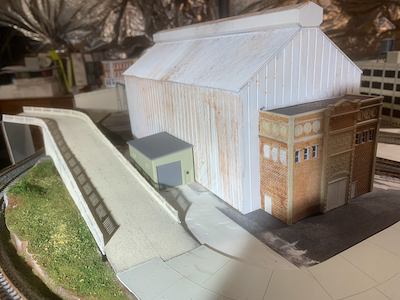
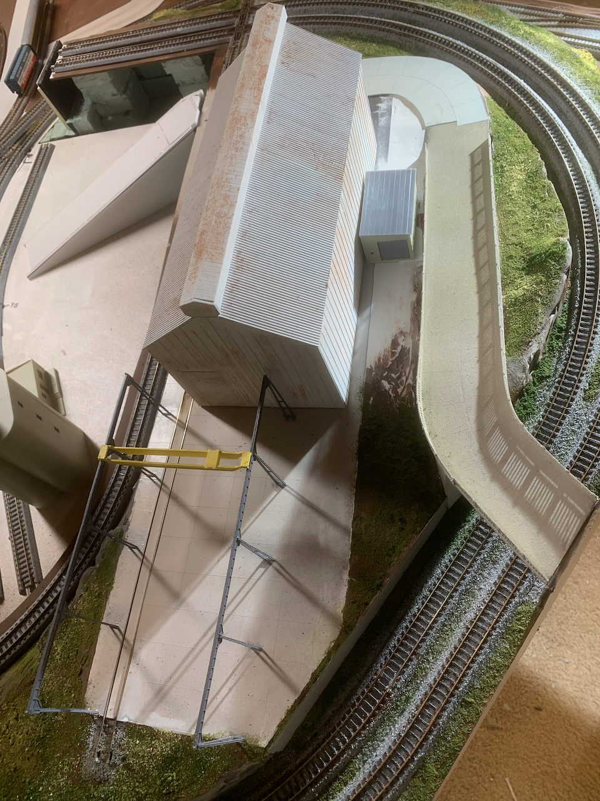
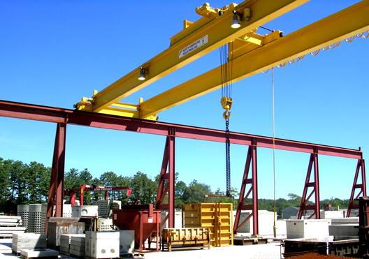
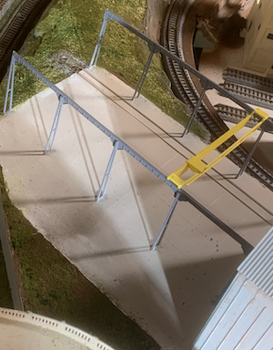

# Unicorn Foundry Building

I want an industry served by flat cars and hoppers. An iron or steel foundry fits in the available space. The foundry might also ship castings or finished goods by box car.

I designed the foundry with a 19th century front office and a more modern fabrication facility. Foundries used to be "smoke stack" industries that burned coal to heat furnaces. After WWII, smaller cheaper foundries that use electric forges replaced the sprawling dirty complexes. In my layout's universe, the Unicorn Foundry switched over to more economical electric forges in a modern (as of the 1960s) building. Sadly, low prices and foreign competition have strained the business. Non-essentials like exterior paint aren't in the budget, so unsightly rust becomes the inevitable result.

This structure was trivial to design and 3D print. It looks out of scale to my eyes, but I checked and double checked the dimensions against prototypes. Modern-ish foundry buildings are about 6 stories high and have roof ventilation systems that are ten feet across. There is a 30ft "high bay" door in the back of the structure that is also prototypical.

I also designed and printed a overhead crane for transferring cargo between the work yard and rail cars. I'll eventually fill the work yard with crates, rolled steel coils, scrap metal, etc. I'll add fencing around the work yard, weather the concrete, etc.

 

## Why Unicorn?

In spite of the gritty urban industrial setting of my layout, my wife has been insisting the layout needs unicorns. So far, I haven't found any N scale unicorn figures. For now, my plan is to use a unicorn figure that is approximately 1::80 scale and put it on the roof of the foundry's office building. It will be the logo/sign for the business. I get to add a little visual interest with a story to tell, and I please my wife!

## Weathering/Rust

The building's walls are printed in multiple parts because the building is larger than the "build plate" in my 3D printer. Once everything is glued together, I spay paint the "modern" part of the structure with white Rustoleum primer. After the paint dries, I shave chalk dust off an inexpensive brown "sidewalk chalk" that's intended for children. I let the dust fall wherever. I've never purchased proper "weathering powders". I've always used chalk, diluted India Ink, and de-glossers like Testor's Dullcote. I sometimes use hairspray that never fully dries. It remains tacky forever which is good when you want to play with effects or want to wipe it all clean with hot water. When everything seems right, I apply Dullcote or similar product over the hairspray and make it all permanent.

[Back](https://nscale4by8.github.io/nscale4x8/)
