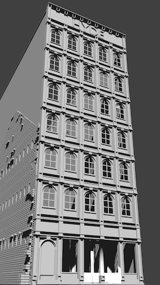
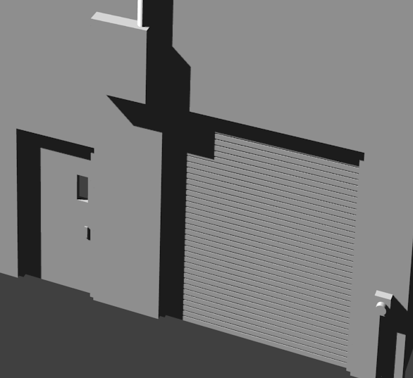

# Hyde Building

The Hyde Building is the first complete large structure I have designed from scratch and printed. I started my 3D printing adventure by designing N-Scale lift bridges. The primary reason the bridges cme first was to get trains running as soon as possible on my new layout. Three totally custom bridges were needed. There is a small structure to house the machinery and operator's controls for the bascule bridge, but it is so simple that it could be printed as one pice plus a gabled roof. Steel bridges are also easier to design and don't push the limits of my printer's capabilities. One lattice girder is much like another. There are tricky design elements like providing adequate surface area for glue joints, but even complex trusses are composed of relatively few distinct shapes replicated many times.

  

I held off designing prototype buildings because I couldn't quite get my printer to print N-Scale bricks. One advantage of the Hyde building is the prototype's cast iron facade - there are no bricks on the front. I like the cast iron look and found many prototype examples. Sadly, after I was satisfied with my 3D model and printed the facade, it languished without companion walls. I needed to made a modeling/printing approach breakthrough to make further progress.

Trying something different, I designed interlocking components for reinforced concrete buildings with concrete block curtain walls like the one in the background here.  I just don't find such buildings intriguing enough to invest a lot of time designing them. I'll probably use the designs for some nondescript buildings here and there. I just don' see them as focal points on the layout.

I put aside building and moved on to printing concrete retaining walls. The walls are simple, but they are still unique to my layout. I printed varying heights to match the changing grade of the tracks. 

But, the Hyde building continued to loom in my imagination. After endless printer tweaking, I finally succeeded printing bricks that are only a little oversized for the scale! 

## Ghost Wall

I was inspired to model a "ghost wall" by the fantasic example in the [Hudson Terminal N Scale Layout Tour with Chris Brimley](https://youtu.be/8t9uAx1_Gng?t=705) I'm intreagued by indications that structures have a history and have evolved over time with changing uses. A ghost wall makes me speculate about the building that was demolished.

Ghost Wall         |   Detail                   
:----------------------------------:|:----------------------------------:
  |  

## Why Not Use Premoulded Brick Sheets?

I don't like is the brick pattern of pre-molded styrene brick sheets. The basic "running bond" pattern where all the bricks are "stretchers", and each brick is staggered half a brick's width from the next row is a modern quirk. The pattern has no structural integrity. It's like inoperable shutters on a home - decorative but useless. Structural brick walls have have alternate courses of stretchers and headers. I decided to model [a version of the Dutch bond](https://en.wikipedia.org/wiki/Brickwork#/media/File:Brickwork_in_english_garden_wall_bond_rake.svg) that is common in the older buildings of the Cleveland flats.

## Other Details 

Back         |   Other Side                   
:----------------------------------:|:----------------------------------:
  |  
  |  

I bricked-up some of the windows and modeled details to the limit of my printer's capabilities.  There is a texture to the loading door. I added miscelaneous mechanical boxes. 

[Back](https://nscale4by8.github.io/nscale4x8/)
