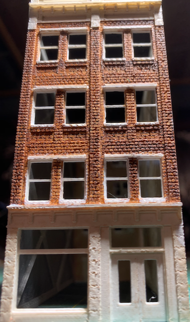
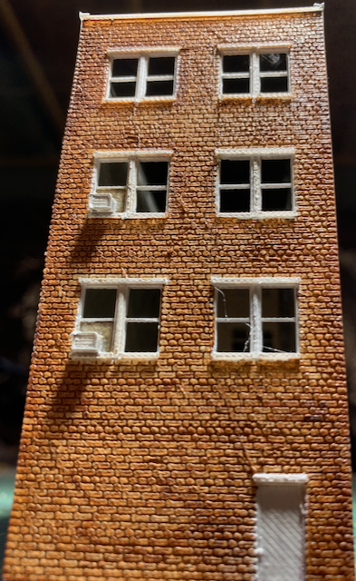
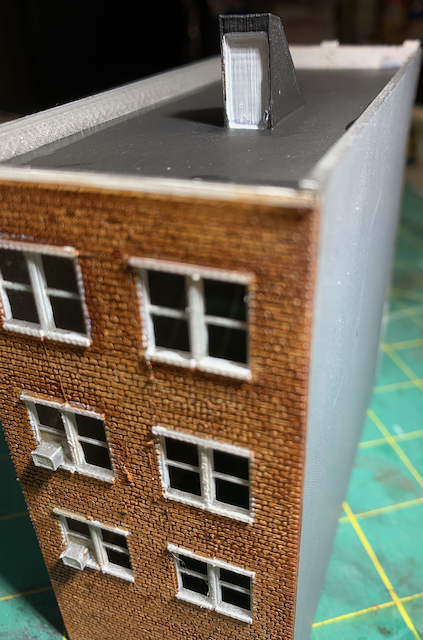

# Middle Building

I call this model the Middle Building because it goes in the middle of a block on my layout.

The Middle Building has so far been that rare example where the original 3D model printed to my satisfaction on the very first try. I built the model while watching Frontline on TV. I woke up the next morning and started the print before calling into a work telecon. By the time I got off the phone, the print was complete. Later that day, I painted the plastic.

Front Elevation         |   Back                   
:----------------------------------:|:----------------------------------:
   |  

 

I enjoy modeling little details. I included window air conditioners right in the 3D model. I added a roof acces to provide some variety to the otherwise barren roof. The trick is to make sure the door is plumb-vertical even though the roof slopes. I'll add some moulded plastic roof detail acessories like plumbing vents in the future.

[Back](https://nscale4by8.github.io/nscale4x8/)
