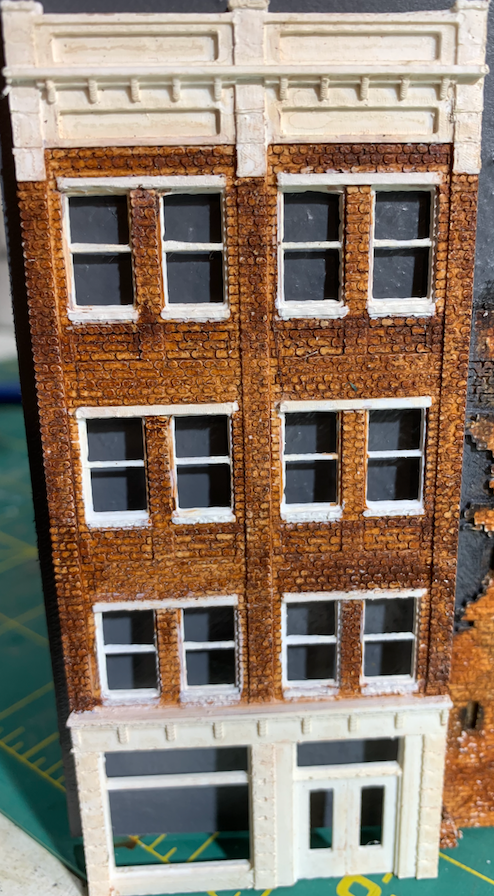

# Middle Building

I call this model the Middle Building because it goes in the middle of a block on my layout.

The Middle Building has so far been that rare example where the original 3D model printed to my satisfaction on the very first try. I built the model while watching Frontline on TV. I woke up the next morning and started the print before calling into a work telecon. By the time I got off the phone, the print was complete. Later that day, I painted the plastic.

  

[Back](https://nscale4by8.github.io/nscale4x8/)
