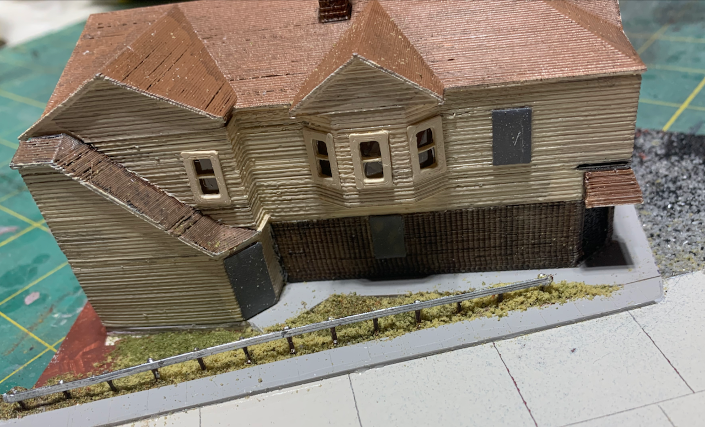
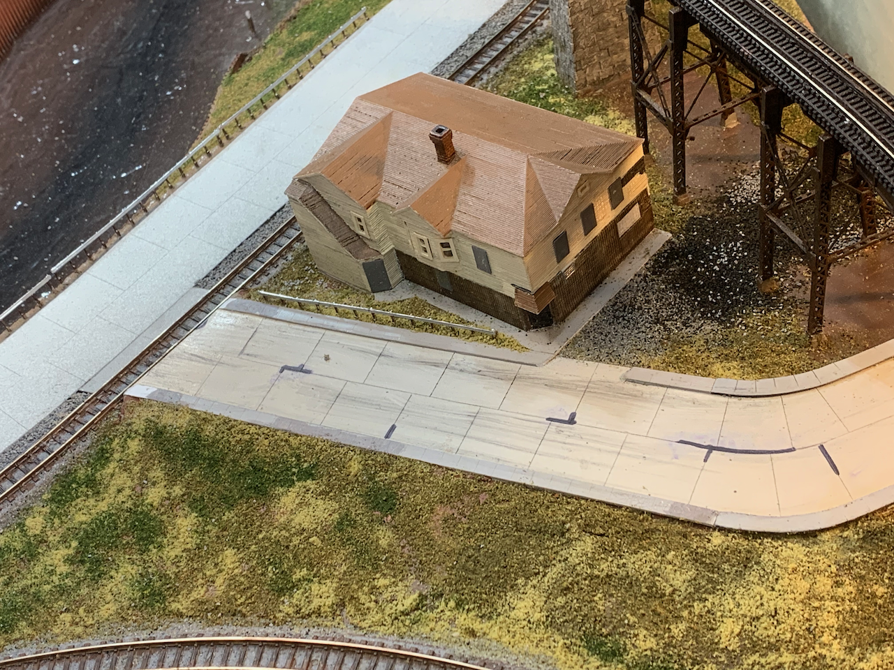

# Pat's in the Flats

Pat's in the Flats was a famous dive bar in the Cleveland Flats Industrial District.

Even though the overall layout is a "Spaghetti Bowl" of track, I try to create recognizable vignettes.

## Models and Printing

[STL File](CornerBarDilapidatedRevB.stl)

[Back](https://nscale4by8.github.io/nscale4x8/)
