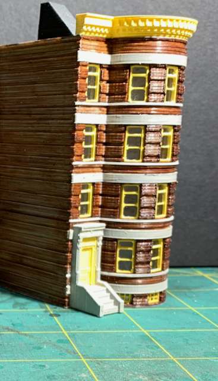

# The Turret Apartments

The "Turret Apartments" structure was designed from scratch, 3D printed, painted, and assembled over the course of three evenings and a Saturday morning. I needed a medium relief structure to populate a street along an edge of my layout.

Model Rendered in Blender           |   Printed & Assembled                
:----------------------------------:|:----------------------------------:
   |  

## A Future Home on the Layout

The structure next door is St. Rita's. There is a [brief article](../buildingStRitaStartToFinish/buildingStRita.md) about designing and printing St. Rita's.

## Inspiration

I usually find inspiration from the structures I see around me. Sometimes, I fall into a Internet rabbit hole searching for architecture that suits my layout. This time, my search popped up the web site of a kindred spirit. [The Railroad Connection](https://www.therailroadconnection.com) sells 3D printed models in various scales. I was inspired by [The Railroad Connection "Brownstone Building Brooklyn NY"](https://www.therailroadconnection.com/collections/buildings/products/1-160-n-scale-3d-printed-brownstone-building-brooklyn-ny)

## Design

I create my own designs tailored for specific locations on my layout and the capabilities of my 3D printer. I use the free SketchUp2017 program for most aspects of the design and use the free Blender program for final processing and export as a .STL file that can be printed. 

## Gallery

[Back](https://nscale4by8.github.io/nscale4x8/)
