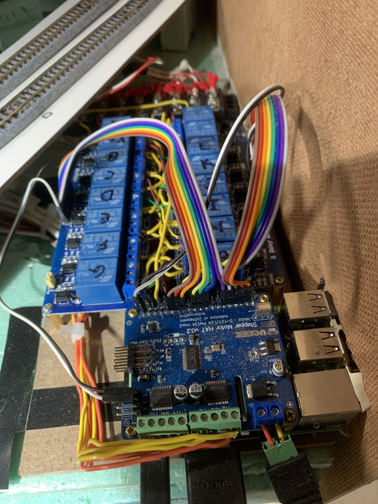
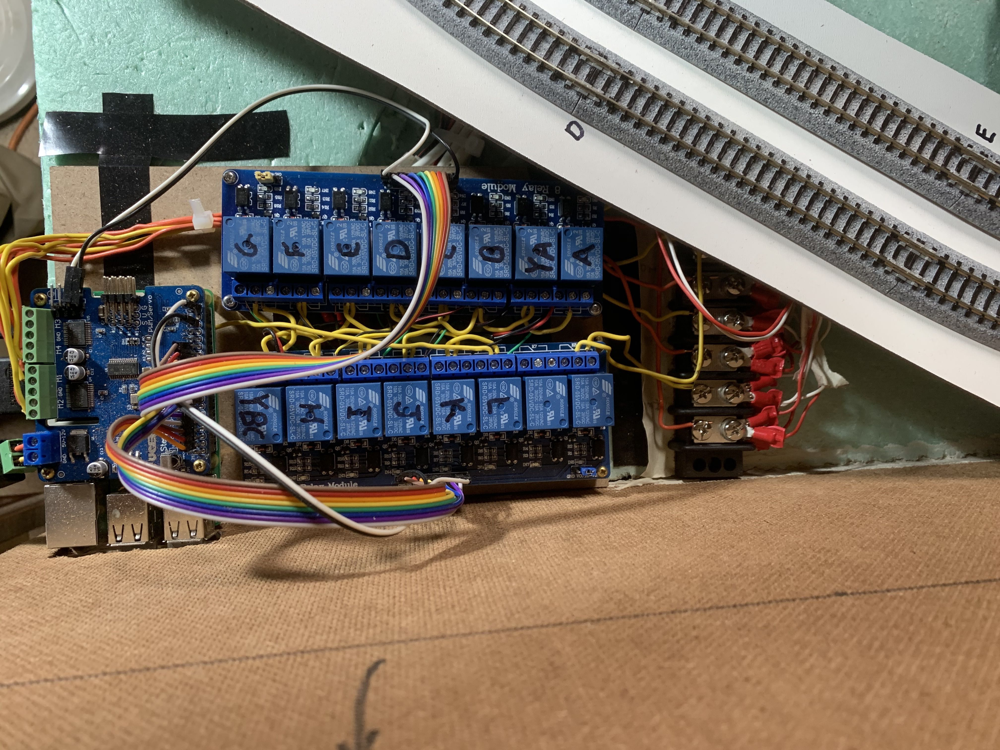

Layout control is implemented by a Raspberry Pi B+ with an add-on "hat" that provides four motor controllers. Three motor controllers are used as throttles so that three separate trains can be independently controlled. The remaining motor controller is connected through relays to actuate remote turnouts (one turnout at a time). Sixteen relays are individually controlled using general purpose input/output pins provided by the Raspberry Pi.

The Raspberry Pi provides wireless access accepting commands from a laptop or smart phone. Each throttle can be manually set, and each turnout can be actuated independently. However, there are three pre-configured fully automated "modes" that may be selected. Once selected, all of the turnouts are set appropriately for the mode, and throttles are adjusted under computer control. This allows a quick setup for passive operation to watch trains run. I may take the layout to a show sometime, and full computer control will be useful in that environment. I'll be able to chat or even walk away from the layout while it runs itself.

**Most recent changes:**

- turned relays 180 deg. and re-routed wires up the middle under the relays.
- labeled the relays instead of relying solely on labels attached to the wires.
- wire tied bundles of wire to simplify routng through bencwork

### Thoughts About DCC                     

Digital Command Control (DCC) is probably great, but it's expensive. For a small layout, a Raspberry Pi (approximately $35), motor hat ($22), and a USB wifi adapter ($7) can provide excellent control for operating sessions. 

I use Kato turnouts. They can be manually actuated, or Kato's control switches may be used. The relays in my setup are only needed if you want automatic computer control of the remote turnouts. The relays came in a package of two boards (a total of 16 relays) for $25. I prototyped a system using $0.10 transistors, but I was afraid the remote turnouts' piezoelectric actuators might draw too much current for the transistors. The relays are a safe reliable solution that never gets hot.

Kato turnout actuators use the polarity of the current to determine the direction the points will move. They must only be energized for short periods or the piezoelectric coils may burn out. The Raspberry Pi runs software that energizes each turnout actuator for 0.2 seconds. I use one of the four motor controllers on the motor controller hat to supply current in either direction to move the turnout's points. 

[Back](https://nscale4by8.github.io/nscale4x8/)
