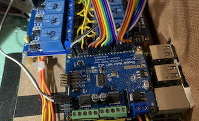

# N Scale 4x8
This is a site for information and resources related to my N Scale layout started 2019.

## Table of Contents

Section         |  Section         
:-------------------------:|:---------------------------:
[**Prototype (Cleveland Flats)**](prototypeInspiration/Prototypes.md) Densely packed industries ,complex web of rails, grades with over and under passes, level crossings, and multiple lift bridges.   | [**Track Plan**](plan/plan.md)  Adapted from [Atlas Granite Gorge & Northern](https://www.modeltrainforum.com/picture.php?albumid=241&pictureid=2492) to enable more continuous run variations 
[**3D Printed Bridges**](printedModels/Custom3DPrintedBridges.md) Antique to old to modern lift bridges   | [**Scenery**](Scenery/Scenery.md) Construction of various sections of scenery ranging from industrial structures to cuts through sedimentary rock to overpasses   
[**Benchwork**](benchwork/benchwork.md) dimensional lumber covered with 2 inch medium density foam | 
 | [3D Printed Retaining Walls and Underpasses](https://nscale4by8.github.io/nscale4x8/Scenery/part01/part01.html)
 | Roads and Sidewalks - Styrene is actually a "For Sale" sign purchased from Wall-mart
 | 3D Printed Custom Structures - Start to fill in the urban-industrial scenes - [Hyde Building](buildingHyde/buildingHyde.md) - [Middle Building](buildingMiddle/buildingMiddle.md) - [Block Building](buildingBlock/buildingBlock.md) - [The Cleveland Twist Drill Co.](buildingClevelandTwistDrill/buildingCYDC.md)
[**Electronic Control**](controls/Control.md) Raspberry Pi B+ with an add-on "hat" | 
[**Downloadable Models**](downloadableModels/downloadableModels.md) | For the purpose of licensing, all models here are considered "software" and are MIT Licensed. The MIT License permits Commercial use, Modification, Distribution, and Private use.
