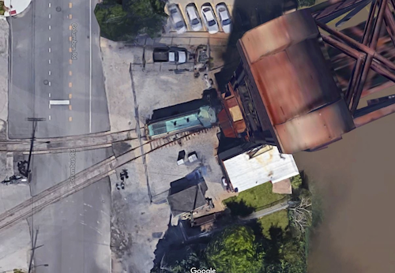

# nscale4x8
This repository contains information and resources related to my N Scale layout started 2019.

## Prototype Inspiration

I am loosely modeling the Cleveland Flats from around 1960. I selected the prototype location for the opportunity to model densely packed industries and a complex web of rails. The prototype includes grades with over and under passes, level crossings, and multiple lift bridges.

[Images of Prototype](prototypeInspiration/Prototypes.md)

## Track Plan

The plan is inspired by the famous [Atlas Granite Gorge & Northern](https://www.modeltrainforum.com/picture.php?albumid=241&pictureid=2492). I adapted it to enable more continuous run variations. 

- The adapted plan can be configured as a double track figure eight with two trains running in opposite directions.
- The adapted plan enables local switching operations on sidings while other trains run continuously.
- The adapted plan can be configured as a twisted dog-bone that crosses the river six times before traveling over the same segment of rail twice.
- The adapted plan provides two variants of out-and-back originating either direction from the industries along the river.
  

[Plan](plan/Rev8Blocks.pdf)

## Benchwork Test Fit

The benchwork is currently dry-fit. Nothing is glued down. All of the wiring is in place for four separate electrical blocks. All turnouts are remotely operated by the Control System. I plan to test the layout for a while to assure reliable operation because once the benchwork is glued, it will be very difficult to modify wiring.

The benchwork consists of 1x2 dimensional lumber covered with 2 inch medium density foam. Then another quarter inch of foam covers everywhere except the river. Channels are cut in the quarter inch foam to provide routing for bundles of wires. On top of the quarter inch layer, one inch foam "feet" support the lowest track elevations. Feet of various lengths create grades and elevated sections. Pre-primed Masonite rests atop the foam feet. Track will eventually be glued to the Masonite.

[Benchwork](benchwork/benchwork.md)

## Electronic Control

Layout control is implemented by a Raspberry Pi B+ with an add-on "hat" that provides four motor controllers. Three motor controllers are used as throttles so that three separate trains can be independently controlled. The remaining motor controller is connected through relays to actuate remote turnouts (one turnout at a time). Sixteen relays are individually controlled using general purpose input/output pins provided by the Raspberry Pi.

The Raspberry Pi provides wireless access accepting commands from a laptop or smart phone. Each throttle can be manually set, and each turnout can be actuated independently. However, there are three pre-configured fully automated "modes" that may be selected. Once selected, all of the turnouts are set appropriately for the mode, and throttles are adjusted under computer control. This allows a quick setup for passive operation to watch trains run. I may take the layout to a show sometime, and full computer control will be useful in that environment. I'll be able to chat or even walk away from the layout while it runs itself.

### Thoughts About DCC                     

Digital Command Control (DCC) is probably great, but it's expensive. For a small layout, a Raspberry Pi (approximately $35), motor hat ($22), and a USB wifi adapter ($7) can provide excellent control for operating sessions. 

I use Kato turnouts. They can be manually actuated, or Kato's control switches may be used. The relays in my setup are only needed if you want automatic computer control of the remote turnouts. The relays came in a package of two boards (a total of 16 relays) for $25. I prototyped a system using $0.10 transistors, but I was afraid the remote turnouts' piezoelectric actuators might draw too much current for the transistors. The relays are a safe reliable solution that never gets hot.

Kato turnout actuators use the polarity of the current to determine the direction the points will move. They must only be energized for short periods or the piezoelectric coils may burn out. The Raspberry Pi runs software that energizes each turnout actuator for 0.2 seconds. I use one of the four motor controllers on the motor controller hat to supply current in either direction to move the turnout's points. 

[Control](controls/Control.md)

## 3D Printed Custom Bridges

[Lift Bridges](printedModels/Custom3DPrintedBridges.md)

## 3D Printed Custom Structures

Model         |   Printed                   
:----------------------------------:|:----------------------------------:
  |  

[Buildings](buildingHyde/buildingHyde.md)

Model         |   Printed                   
:----------------------------------:|:----------------------------------:
 |   

[Buildings](buildingMiddle/buildingMiddle.md)

## Scenery

[Scenery](Scenery/Scenery.md)

