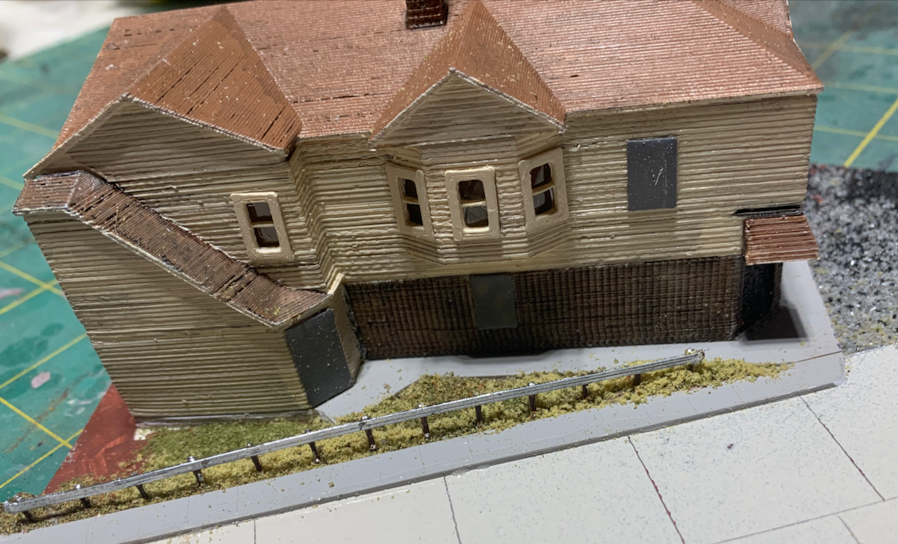
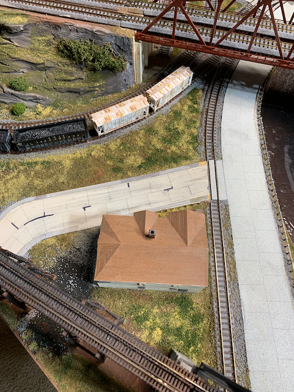
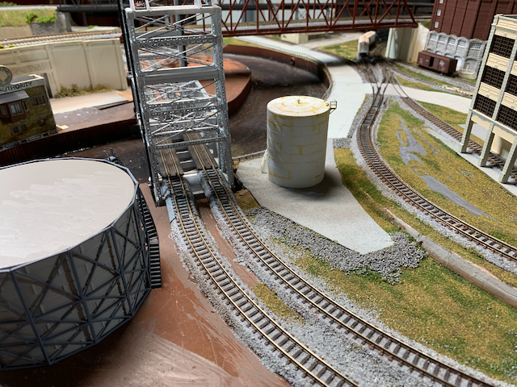
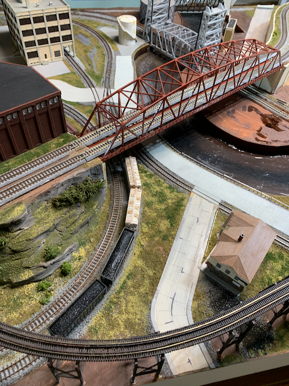

# Followup to "Modeling Concrete Roads From Styrene"  Article.

In 2020, I wrote an article for ["Nscale Modelrailroading" issue #122](https://nscalerailroadingmagazine.com/wp-content/uploads/2020/07/122-01-39-2020-JUL-01.pdf). It suddenly occurred to me to post a followup.

Here some more recent views of the roads build for the article:

