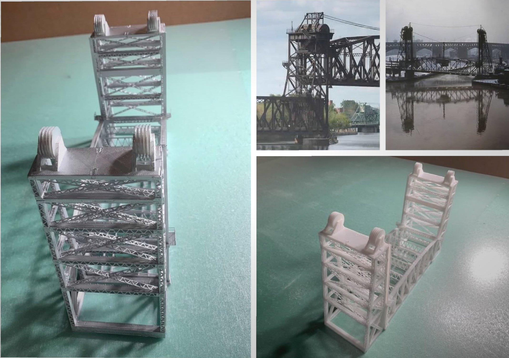
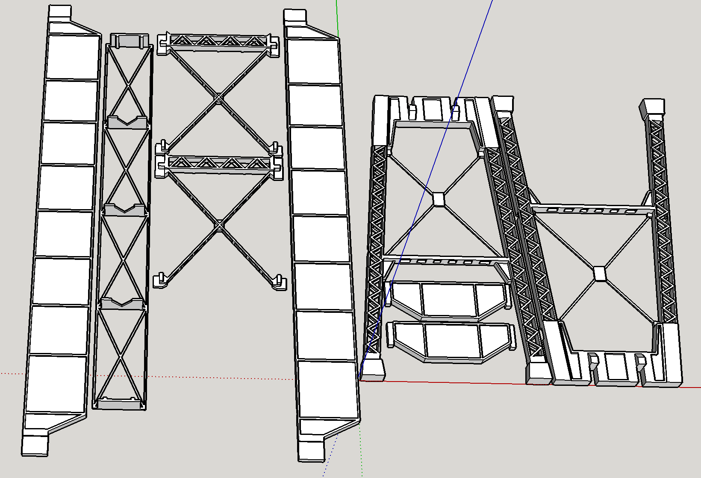

# My Original 3D Models Printed

I am combining my interests in 3D modeling, 3D printing, and model railroading. I am modeling the Cleveland Flats and its myriad of lift bridges over the Cuyahoga River. All of the bridge models are originals. Prototype inspirations are provided side by side for comparison.

I printed the models myself using PLA plastic filament. I have a Bibo printer which I think is a generic version of some common design because there are many similar ones on the market.

The printer is advertised as capable of printing 0.4mm wide items and 0.05mm layer heights. When I first started, I used the highest resolution settings thinking they would produce the best results even though simple prints took many hours.

0.4mm corresponds to 2.4 inches in N-Scale. 0.05mm is 0.3 inches in N-Scale. Roughly speaking, the resolution is enough to print N-Scale hand rails, door knobs, ladders, etc., but it's a bit too thick for window mullions.

I discovered that 0.2mm layer heights work best with my printer. They produce the smoothest results. I also discovered that if the print head moves fast enough, it stretches the hot filament and can create thicknesses much less that 0.4mm. Consequently, I usually print with 0.2mm layer heights at about double the default speed. I can produce mullions and other details at about the same sizes as commercial moulded parts. I can print details that are in the neighborhood of 1.4 or 2 scale inches. I typically print with finest details perpendicular to the base. In other words, I print the finest details in the width direction as opposed to the height direction.

I also printed bridge abutments modeling cut stone. The details are quite fine. There are no two stones that are exactly the same.

[Back](https://nscale4by8.github.io/nscale4x8/)
