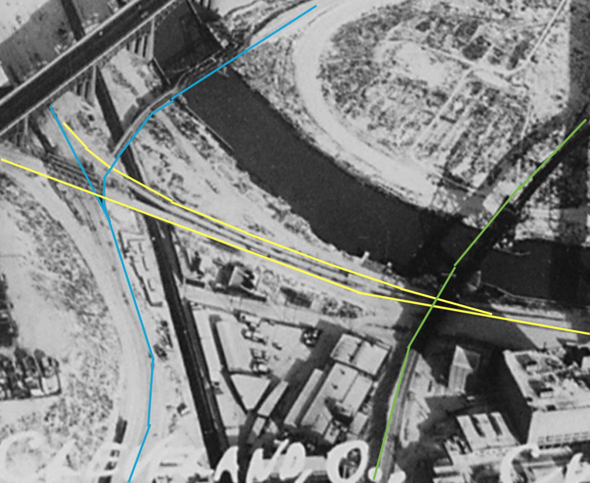

# Prototype Inspiration

The Cleveland Flats were once a site of densely packed industries including multiple steel mills. Cleveland's Lake Erie port received iron ore from mines along the shores of Lake Superior. Cleveland also received coal via the Great Lakes, but coal primarily arrived from Appalachia via rail. Something like four times as much coal is needed compared to iron when making steel, and Cleveland's proximity to the coal combined with a port for receiving iron made it a prime location. As far as I know, only one steel mill remains on the Cuyahoga River.

The Flats were once served by at least four major railroads and a couple of regional ones. With limited rights of way available, the railroads stacked themselves atop each other. There was a narrow tributary to the Cuyahoga River up-steam from the Flats where three railroad bridges crossed over each other at different elevations. I haven't yet found a picture online, but old maps show it, and there is a large format aerial picture of it in the Great Lakes Science Center. Whenever someone says a scene is unrealistic because railroads never built bridges over bridges, tell them about Cleveland.

Although not quite as astounding as bridges over bridges, I highlighted three separate rail lines crossing each other at different elevations. Green crosses over yellow. Yellow crosses over blue. In the same area, yellow also has a grade crossing at an interchange yard with blue. Two lift bridges, a viaduct, and multiple trusses are shown.

The linked aerial photo shows two separate steel mills and countless other rail served industries crammed into the Flats.

[1937 Aerial Photo Shows Ten Railroad Bridges Over The Cuyahoga River in the Flats](https://upload.wikimedia.org/wikipedia/commons/a/a5/Downtown_Cleveland%2C_Ohio%2C_in_winter%2C_from_the_air%2C_12-1937_-_NARA_-_512842.jpg)

[1892 Map of Cleveland Flats](http://www.clevelandmemory.org/iac/graphics/map1.gif)

## Gallery

[Aerial View](Screen Shot 2020-04-27 at 8.20.44 PM.png)

[Street View Older Lift Bridge](Screen Shot 2020-04-27 at 8.32.43 PM.png)

[Street View Viaduct](Screen Shot 2020-04-27 at 8.50.08 PM.png)

[Street View Crossing A](Screen Shot 2020-04-27 at 9.13.35 PM.png)

[Street View Crossing B](Screen Shot 2020-04-27 at 9.15.43 PM.png)

[Street View Crossing C](Screen Shot 2020-04-27 at 9.24.43 PM.png)

[Street View Crossing D](Screen Shot 2020-04-27 at 9.30.22 PM.png)

## Other

- [B&O Overpass](BandO_overFlatsIndustrial.png)
- [Lift Bridges Over and Under](LIftBridgesOverUnder.png)
- [Curved Approach to Lift Bridge](curveToLiftBridge.png)
- [Crossing at Approach to Bridge](levelCrossingAtBridge.png)
- [Multiple Spurs to Industries with Many Grade Level Crossings](industry.png)

[Back](https://nscale4by8.github.io/nscale4x8/)
