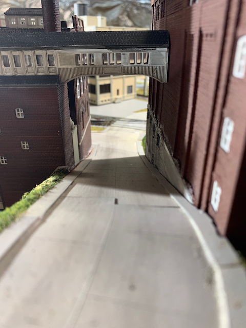
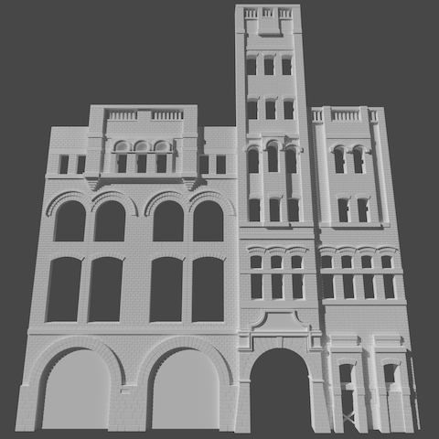
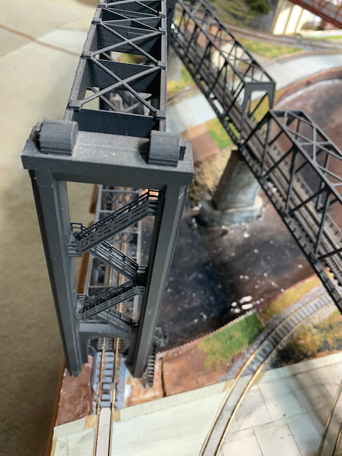
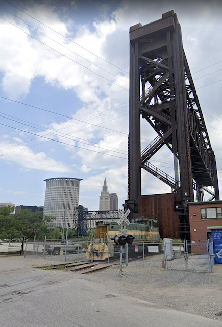
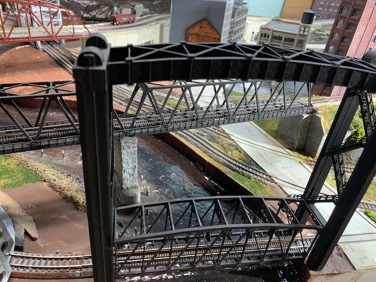
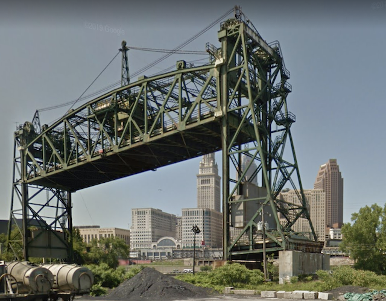
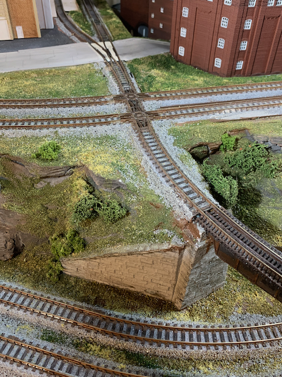
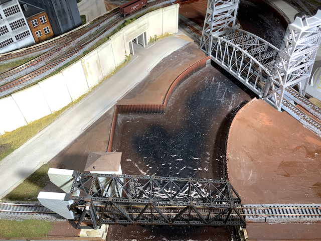
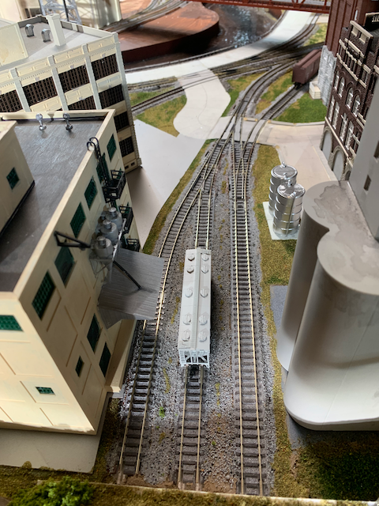

# Vignettes Inspired by Prototypes

| Brewery                      |                              |
|------------------------------|------------------------------|
|    |      |
|    |      |
|      | The prototype location in the Cleveland Flats is the site of a commercial bakery. I took some liberty and made a Brewery instead. I stumbled upon the prototype Tennessee Brewery in Memphis TN. It inspired the 3D model you see printed here.
|

| Block Building               |                              |
|------------------------------|------------------------------|
|               |  |

| Pat's in the Flats           |                              |
|------------------------------|------------------------------|
|||
|       ||

| Grade Crossing to Modern Lift|                              |
|------------------------------|------------------------------|
| | |
||  |

| Double Track Truss Lift      |                              |
|------------------------------|------------------------------|
|||

| Diamond Into Bridge          |                              |
|------------------------------|------------------------------|
|||

| Lift Bridges in Context      |                              |
|------------------------------|------------------------------|
|  |     |

| Urban Tunnel                 |                              |
|------------------------------|------------------------------|
|     |       |

| Road Underpasses             |                              |
|------------------------------|------------------------------|
|   | |
|       |         |

| Road Arch Overpasses         |                              |
|------------------------------|------------------------------|
| |   |

| Overhead Crane               |                              |
|------------------------------|------------------------------|
|    |      |

| Industry for Grain Hoppers   |                              |
|------------------------------|------------------------------|
|||
||

| Worlds Longest Bascule Bridge|                              |
|------------------------------|------------------------------|
|         |           |
|         |           |
|         |           |

| Rails Below Grade            |                              |
|------------------------------|------------------------------|
| |   |
| |                              |

[Back](https://nscale4by8.github.io/nscale4x8/)
